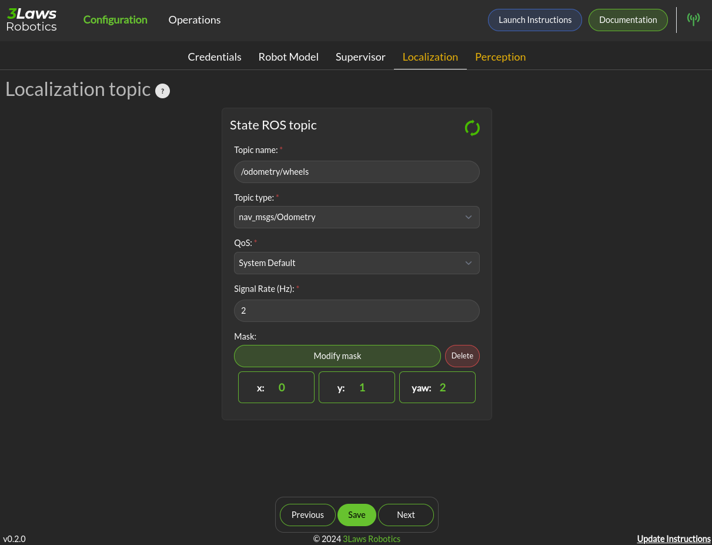

Localization
============

Dialogs to connect to the state information provided for the robot and for configuring alerts based on state are on the Configuration > Localization page. contains configuration entries for both the monitoring and input filtering components.

- **Localization topic**: The connection to the ROS state topic is configured in this area. As with input commands, the message topic name, message topic type, expected message topic quality, and expected message rates are specified. If the message quality fails or the message receipt rate is not met, the monitor will issue alerts, and the Copilot will switch to the Failsafe strategy. The mask needs to be customized if the localization topic does not respect the standard ROS message. The index in the input vector relating to the individual states (x, y, yaw) needs to be set correctly.
