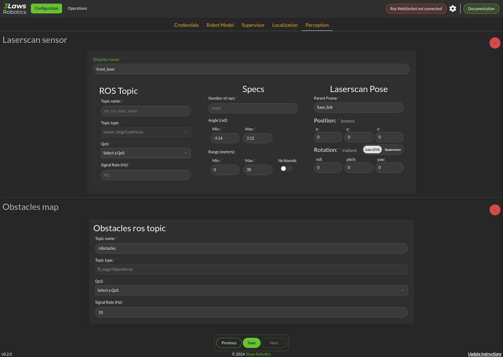

Perception
============

The collision avoidance depends mostly on the Configuration > Perception dialog where the connection and description of either a laserscan sensor or an obstacle map message is configured.

- **Laserscan sensor**: The Supervisor can handle data points from one 2-dimensional laser (LIDAR) scanner.

  * **Display name**: A user-specified name can be provided so that diagnostic information can quickly be understood.

  * **ROS Topic**: The ROS message name, topic type, quality of service and Signal Rate must all be specified so that the Supervisor can subscribe to the sensor data.

  * **Specs**:  The expected number of points per scan along with the first (typically minimum) and last (typically maximum) angle must be specified so that the angular resolution can be calculated for the nominal case. The first and last angle values should normally describe a laser that scans in the clockwise direction, so the first is smaller than the last. However, if the laser scans in the counter-clockwise direction the first angle should be set to be smaller than the last.  It is very important that the total range of the laser is less than 2π.  The Supervisor does not disambiguate angles if the total field is larger than 2π.  The scanner's range can be set so that readings smaller than the minimum or larger than the maximum are discarded.

  * **Laserscan Pose**: The orientation and position of the laserscan relative to the vehicle body or whichever frame is used must be specified. As with the robot's body position, the user is advised to plot the data in rviz to ensure that the geometry is set correctly.

- **Obstacle Map**: An existing perception system can be used instead of a 2D-LIDAR, but it most provide an ObjectArray that matches the definition for an lll_rsgs/ObjectArray.  The definition is as follows:

.. code::

   std_msgs/Header header
   Object[] objects

where Object[] is defined by:

.. code::
          
  std_msgs/Header header
  # Identifier of the object
  string id
  # Object geometry, and pose of geometry in object frame
  ObjectGeometry geometry
  # Object pose world frame
  geometry_msgs/PoseWithCovariance pose
  # Object velocity in object frame
  geometry_msgs/TwistWithCovariance velocity
  # Object behavior model
  # Bounds on object frame velocity (considered inactive if non finite)
  geometry_msgs/Twist velocity_upper_bounds
  geometry_msgs/Twist velocity_lower_bounds
  # Bounds on object frame velocity norms (considered inactive if strictly less than 0)
  float64 linear_velocity_norm2_bound
  float64 angular_velocity_norm2_bound
  # Bounds on object frame acceleration  (considered inactive if non finite)
  geometry_mix's/Accel acceleration_upper_bounds
  geometry_msgs/Accel acceleration_lower_bounds
  # Bounds on object frame acceleration norms (considered inactive if strictly less than 0)
  float64 linear_acceleration_norm2_bound
  float64 angular_acceleration_norm2_bound

.. important::

  When using obstacle lists, if the obstacles are in the *world* coordinate frames, the copilot's use of localization must be enabled.

\
