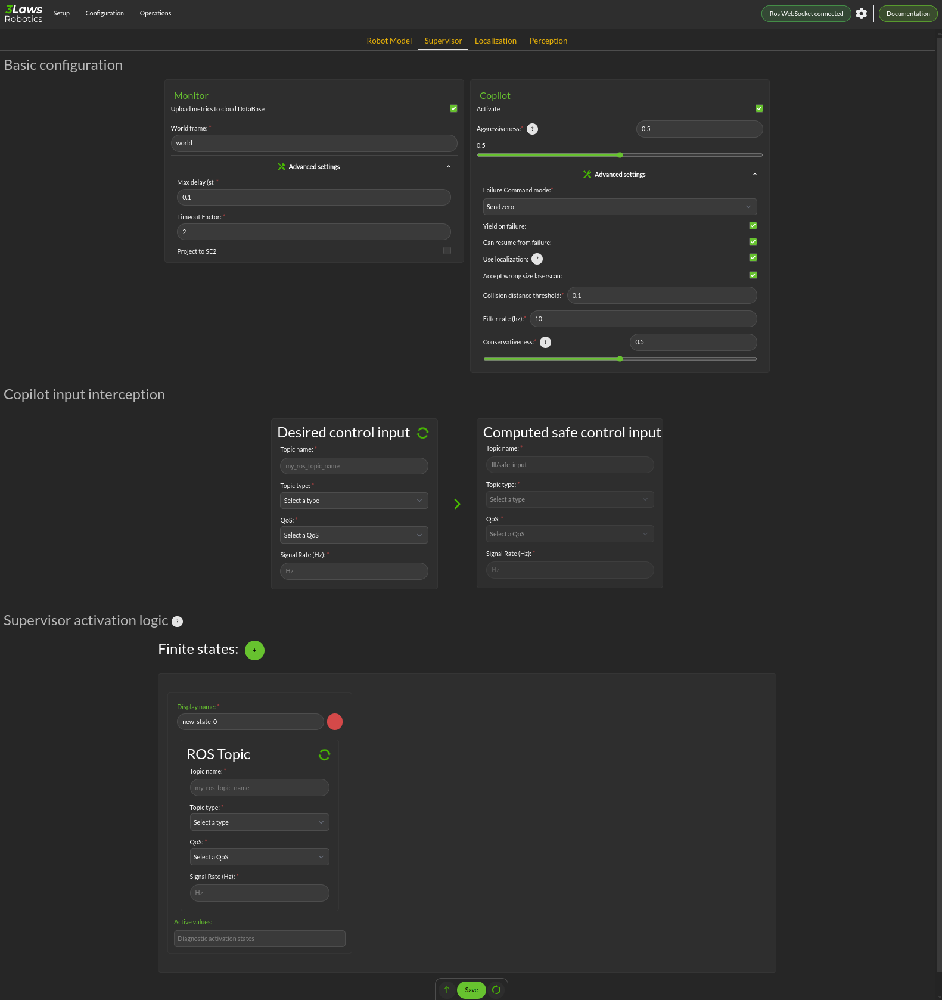

Supervisor
==========

The Configuration > Supervisor page contains configuration entries for both the monitoring and Copilot components.

- **Upload log to 3laws robotics cloud**: For debugging purposes, 3Laws creates a log when Supervisor is started.  Enabling this option, allows 3Laws to provide better support with troubleshooting if there is a problem.

  * **World Frame**: Similar to "base robot frame", the name of the world frame (typically *odom* or *map*) must be specified.
    
  * **Advanced Settings > Project to SE2**: By default, the system is assumed to operate in 3-dimensional space. Projecting to SE2 assumes that the vehicle is traveling on a flat surface or that its travel distance is small enough that earth curvature effects are not significant.

  * **Advanced Settings**:  The computational priority of the Supervisor node can be set through the "niceness" parameter, where -20 would set it as very high priority and +19 would be very low priority. A niceness of zero is recommended. (Please review documentation on setting priority in Linux using "nice" for a deeper explanation.)  *Retimestamp policy* is used to add or correct the timestamp on log messages that seem to have an incorrect one.  Leaving the timestamp unchanged is also an option. 
      
  * **Copilot**: The Copilot enables the run-time assurance capability where desired commands to the robot from the autonomy stack ("desired inputs") are modified in order to avoid collisions, and altered versions are published through a separate message. 
    
    * **Activate**: This checkbox controls whether the run-time assurance intercepts and modifies commands from the planner/trajectory generator and forwards modified versions to the vehicle. The Copilot will only modify the outputs if the option is activated.  If it is not activated, the unmodified "desired control input" will be transmitted on the designated "Computed safe control" message. 
      
    * **Aggressiveness**: This parameter controls how far from the nearest obstacle the safety filter starts having more effect on the commands and how strongly the safety filter pushes the robot back into the "safe" region if the safety definition has been violated.  A larger value means that the control inputs from the planner will start to be modified when the robot is farther from an object/obstacle.  In general this will produce larger margins.  A larger value also means that if an obstacle is detected within the collision distance, the command modified by the run-time assurance will try to move the robot away from the object more aggressively.  Typical values are between 0.5 and 1.0, but values in the range of 1000 might be used in reasonable situations.  A smaller value means that the the robot will get closer to the obstacles (higher performance) before being diverted. 

  * **Copilot**: The Copilot enables the run-time assurance capability where desired commands to the robot from the autonomy stack ("desired inputs") are modified in order to avoid collisions, and altered versions are published through a separate message.

    * **Activate**: This checkbox controls whether the run-time assurance intercepts and modifies commands from the planner/trajectory generator and forwards modified versions to the vehicle. The Copilot will only modify the outputs if the option is activated.  If it is not activated, the unmodified "desired control input" will be transmitted on the designated "Computed safe control" message.

    * **Aggressiveness**: This parameter controls how far from the nearest obstacle the safety filter starts having more effect on the commands and how strongly the safety filter pushes the robot back into the "safe" region if the safety definition has been violated.  A larger value means that the control inputs from the planner will start to be modified when the robot is farther from an object/obstacle.  In general this will produce larger margins.  A larger value also means that if an obstacle is detected within the collision distance, the command modified by the run-time assurance will try to move the robot away from the object more aggressively.  Typical values are between 0.5 and 1.0, but values in the range of 1000 might be used in reasonable situations.  A smaller value means that the the robot will get closer to the obstacles (higher performance) before being diverted.

 The following are under the "Advanced Settings".  If the Copilot is activated, these should be customized:

      * **Failure Command Mode**: The run-time assurance constantly monitors to ensure that it has enough data to determine whether the robot is in a safe condition. The minimum data required is the vehicle state, the laser scan values, and the commanded/desired input.  If any of these is missing the RTA can switch to the failure command mode:

        * **Send Zero**:  In this mode the run-time assurance commands zero speed and zero turn/rotation in order to bring the vehicle to a stop.

        * **Do not Publish**:  Another option is to stop publishing values.  This option should only be used if the robot has its own mechanism to put itself in a safe condition if it is not receiving commands.

      * **Yield on failure**:  This checkbox is like the "Send Desired" option.  Setting this checkbox will override the failure control mode and just forward the "Desired control input" unmodified.
      * **Can resume from failure**: With this checkbox filled in, once the input data (control input, laser scan, and state) values start appearing after a failure, the robot will be commanded back into motion (if the desired control input is asking for that).  If the box is unchecked once there is a failure, the robot will remain stopped until the Supervisor is restarted.

      * **Use localization**:  Supervisor provides a MarkerArray that displays the robot's bounding box and rays to the closest obstacles.  If "Use Localization" is set, the display is created relative to the world frame.  In situations where the localization may be less reliable, this checkbox can be deselected, and the visualization will be based on the current robot base frame.  Localization is also very useful if the control rate is low (e.g. longer times between commands) or there are delays between sensing and actuating.  If the robot's motion is large during the time period of the control calculation, the model will account for it as long as localization is accurate.

      * **Accept wrong size laserscan**: One of the checks that is made on the incoming data is that the laserscan is delivering the expected number of scan points each frame. However, there are many laser scanners that are not consistent in the number of scan points they deliver.  Checking this option allows for laser scanners with non-constant number of scan points reported.

      * **Collision distance threshold**:  This is one of the most important values to set. This defines the distance between the edge of the robot and the nearest scan at which safety exists.  If the measured distance drops below this value, the system is considered to be in an "unsafe" configuration.

      * **Filter rate (hz)**: The frequency at which the run-time assurance publishes outputs.  It is recommended that the run-time assurance run at the same rate as the desired control input or at a faster rate.

      * **Conservativeness**: A factor that specifies how much uncertainty the robot operator thinks there is in the localization and sensor data.  The ratio between aggressiveness and conservativeness is the main controller of the behavior.  Values below 0.1 are recommended.

- **Copilot input interception**: This section relates to republishing the control commands to the robot that are being sent from the autonomy stack.  The values will be published on the *lll/ram/filtered_input* channel if the Copilot is activate or not.  However, the values will only be different from the *Desired control input* if the Copilot is active.

  * **Desired control Input**: This is the commands requesting speed and rotation (or speed and steering) that the autonomy stack is publishing. The ROS message type is needed so that the RDM knows what to monitor in order to calculate the barrier function value. The message quality and receipt rate are monitored as part of the aggregated metrics, and if it fails to arrive within the expected time [1/(signal rate) * Timeout factor], an event will be created and the Copilot will transition to the failure command mode.

  * **Safe Control Signal**: The right side of this area is purely informational. However, if the robot is to be controlled by the run-time assurance signal, it needs to subscribe to the message that is presented here.

- **Supervisor activation logic**:

  * **Finite States** are messages that the Diagnostics can listen to and issue events when the value of the finite state matches a predefined value.  This could be useful to provide notifications, for example, as the temperature of a component or process reaches predefined values.  If the temperature goes too high or too low, the time at which the threshold is reached may be of interest.  Keep in mind that if a value changes too rapidly, it might pass through a single value too quickly to be detected at that value, so in some cases it may make more sense to use an integer representation of the variable.   Internally, the diagnostic converts the measurand and the threshold to strings for comparison.
