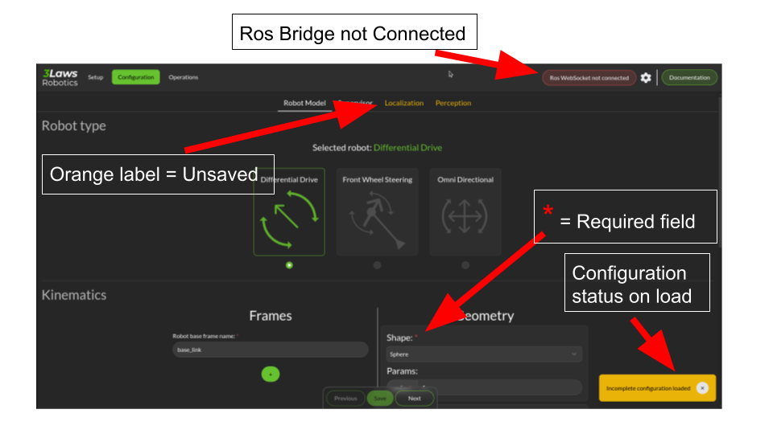
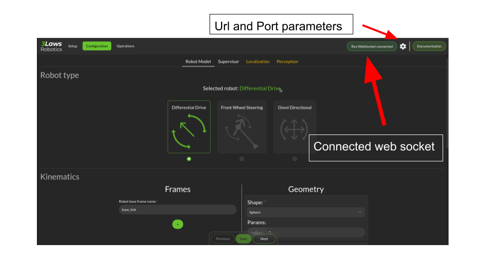

Use the Control Panel
===============

The control panel is meant to be user friendly and safe explanatory.
However some detail might be useful to know.

Here is a picture of the control panel:

The control panel is divided in 3 parts:

- The Navigation bar, where you can find the main pages, a Ros Bridge WebSocket status indicator and a WebSocket parameter button.
- The main page, where you can find the configuration form and the control buttons.
- The footer, where you can find the version number and the 3LawsRobotics website link and a link to the update pages.

In order to use this control panel at its best, you need to configure the Ros Bridge WebSocket parameters.
To do so, click on the WebSocket parameter button in the navigation bar and fill the form with the correct parameters.

By default, the control panel is configured to connect to a Ros Bridge WebSocket running on the same machine, on the port 9090.
More information on the Ros Bridge WebSocket can be found following this link: `Ros Bridge WebSocket <http://wiki.ros.org/rosbridge_suite>`_.

A successful connection to the Ros Bridge WebSocket will be indicated by a green status indicator in the navigation bar.

