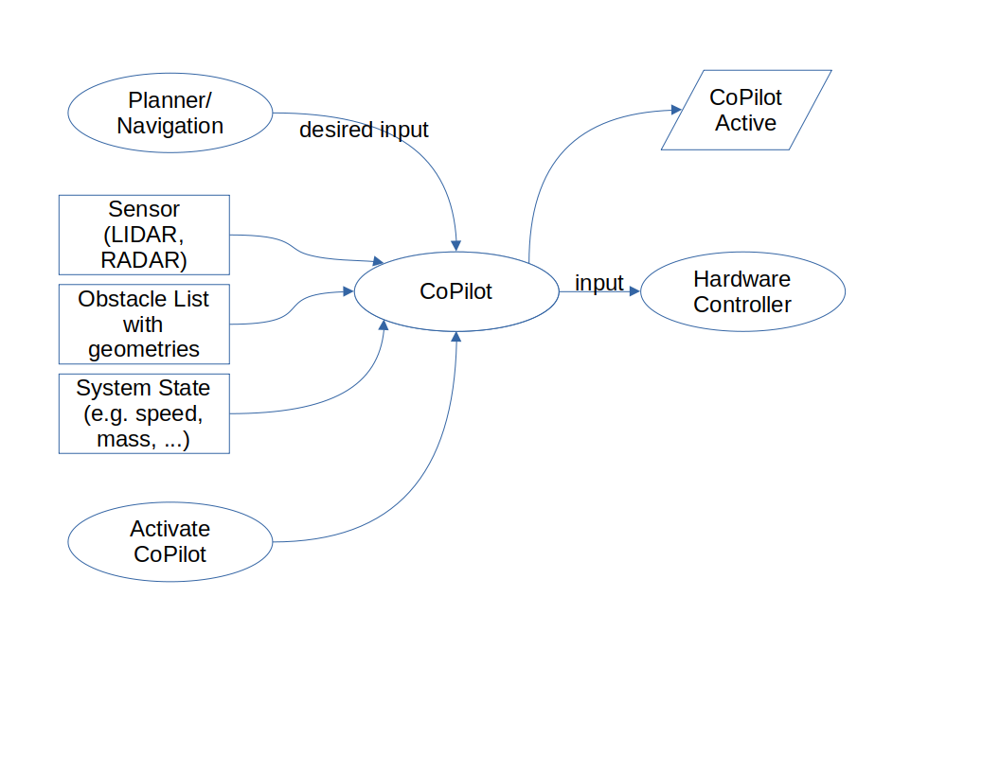
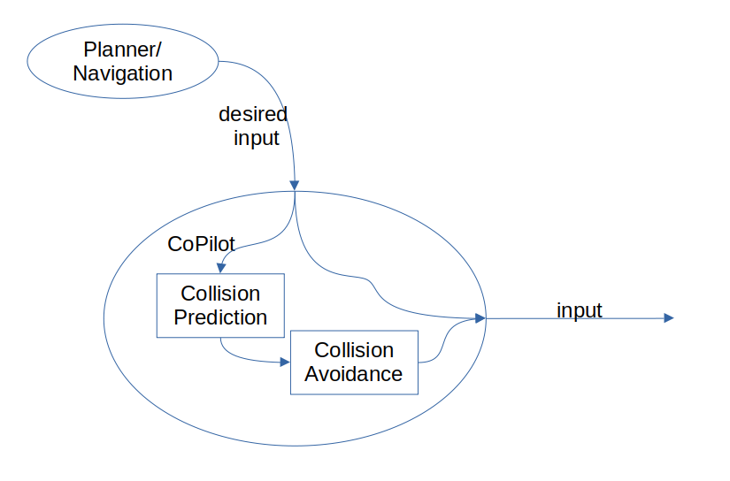

The Supervisor/Copilot
======================

Theory of Operation
-------------------

The 3Laws Copilot is based the theories behind invariant sets for the states
of the device. For systems that
are controlled through feedback or feedforward, the desirable state is based
on the needs of the operation. The idea of an invariant set is that once the
system is within the set, it will be kept within that set by the control or
planning signals and system dynamics.  

on Control Barrier Functions as described in:

**Backup Control Barrier Functions: Formultation and Comparative Study**,
Yuxiao Chen1 , Mrdjan Jankovic2 , Mario Santillo2 , and Aaron D. Ames1,
arXiv:2104.11332v1 [eess.SY] 22 Apr 2021, **Applied Safety Critical Control**
Thomas Gurriet, Doctor of Philosophy, CALIFORNIA INSTITUTE OF TECHNOLOGY, Pasadena, California 2020

A. Singletary, S. Kolathaya and A. D. Ames, **Safety-Critical Kinematic Control of Robotic Systems** in IEEE Control Systems Letters, vol. 6, pp. 139-144, 2022, doi: 10.1109/LCSYS.2021.3050609.

The basic concept is to use the current state of a dynamical system (robot arm,
mobile device, aircraft, marine vessel, etc.) to drive a model of that system.
Inputs including locations, geometries, speeds, and accelerations of obstacles
are also needed when the CoPilot is designed for collision avoidance. A prediction
of when a collision will occur is used as a basis to modify the currently
requested steering/speed/attitude commands when necessary.  The CoPilot uses
an alternative planning/control strategy to prevent the collision by
slowing or diverting the device away from the collision path.  The alternative
control strategy is built into the CoPilot by 3Laws based on the objective
for the particular deployment.

Basic Architecture
------------------

From an operational standpoint, the CoPilot (when used for collision avoidance)
sits between the planning layer and the hardware control layer.  "Hardware control"
typically refers to a speed or attitude controller for a vehicle or a joint
attitude/speed controller for an articulated robot.

The CoPilot will evaluate the likelihood of a collision and will only modify
the desired input from the planner when a collision is predicted within the
estimation window.

There are 2 main steps to integrate CoPilot into an existing stack:
1. Remap the output from the planner (or component that produces commands such
   as the path to follow, the vehicle speed, or the navigation) and set it as
   the input to the CoPilot.  Then remap the input of the controller (or
   component that converts the navigation instructions into hardware/
   actuator instruction to use the output of CoPilot.
2. Start the CoPilot as part of the stack.
   
