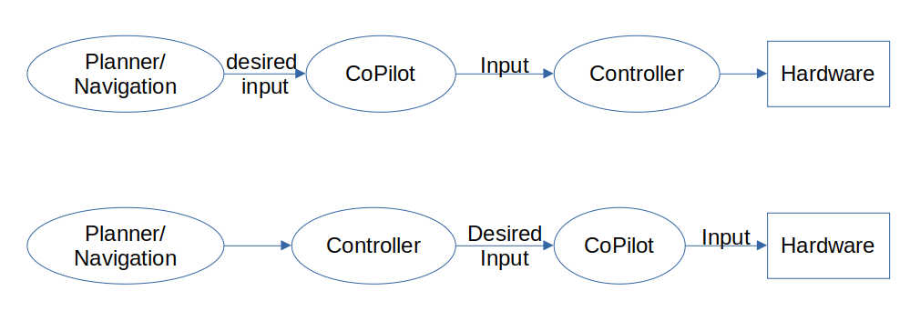

The Copilot
===========

Basic Architecture
------------------

From an operational standpoint, the CoPilot (when used for collision avoidance)
sits between the planning layer and the hardware control layer.  "Hardware control"
typically refers to a speed or attitude controller for a vehicle or a joint
attitude/speed controller for an articulated robot.

.. image:: data/supervisor_architecture_1.png
   :width: 700px
   :alt: CoPilot Architecture showing inputs and outputs from a typical Copilot

The CoPilot will evaluate the likelihood of a collision and will only modify
the desired input from the planner when a collision is predicted within the
estimation window.

.. image:: data/supervisor_architecture_1b.png
   :width: 700px
   :alt: CoPilot Architecture showing inputs and outputs from a typical Copilot

There are 2 main steps to integrate CoPilot into an existing stack:

1. Remap the output from the planner (or component that produces commands such
   as the path to follow, the vehicle speed, or the navigation) and set it as
   the input to the CoPilot.  Then remap the input of the controller (or
   component that converts the navigation instructions into hardware/
   actuator instruction to use the output of CoPilot.
2. Start the CoPilot as part of the stack.

Available Configurations
------------------------

The following configurations of robot platform and operational objective are
currently available.

+---------------------+---------------------+----------------+
| Robot Configuration | Collision Avoidance | GeoFencing     |
+=====================+=====================+================+
| Unicycle            |    in development   |                |
+---------------------+---------------------+----------------+
| Bicycle             |    in development   |                |
+---------------------+---------------------+----------------+
| Copter Drone        |                     | in development |
+---------------------+---------------------+----------------+

Applications
------------
**Active Collision Avoidance**: In the collision avoidance use case, the CoPilot is designed to modify the
planner's outputs in order to prevent impacts between the robot and other
actors/obstacles in the operational space. CoPilot can be used as a redundant
system that filters the planner and only injects changes when a collision is
predicted.  In many cases, this allows for reducing the load on the planner
for calculating paths around obstacles or for using the CoPilot as a redundant
component in the stack, allowing improved reliability calculations by having
a dissimilar component that can perform obstacle handling as a parallel task.
A sensor system that detects the presence of the obstacles (e.g. LIDAR, RADAR,
ultra-sonic) is required for collision avoidance. The sensor suite can be
shared with the stack or can be dedicated.

In the case of a human "planner", the CoPilot can be responsible for avoiding
obstacles (assuming they are detected by sensors).  Avoidance actions that
can be activated in the CoPilot include stopping, avoiding the obstacle to
the left/right, and backing up.  Custom actions (such as diverting and parking
until a moving obstacle on a known trajecotry has passed by) can also be
implemented.

**Repetitive Path Collision Avoidance**: Using a simulation framework with known
obstacles in the space, Copilot can modify pre-planned paths to avoid
potential collisions.  The margins between the robot (even for articulated
robots) and the obstacles can be adjusted based on estimated uncertainties
in the behavior of the robot and of positioning of the fixed objects. The
primary use case for this is for systems that perform repetitive tasks.

**GeoFencing**: In previous deployments, the CoPilot has been inserted into the
autonomy stack at different locations based on the needs for time-criticality.
CoPilot it most often deployed between the planner and the inner-loop controller,
but it can also be deployed between the inner-loop controller and the hardware
for cases where the vehicle, like a racing copter, is going to approach
undesirable configurations at rates that the high-level planner is unable to
replan-for, or if the system is being controlled by a human (or automated
planner) that is not aware of the position of the drone relative to the keep-out
area.

**Configuration Bounding**:
CoPilot's underlying math is designed to control state variables such as
position, speed, and accelerations.  This means that configuring CoPilot to
avoid situations such as vehicle roll-over because of large lateral accelerations
or sliding because of large accelerations can also be implemented as objectives.
Please contact 3Laws for discussions on how these objectives can be made
available.

Platforms
---------
3Laws is pre-packaging several combinations of platform (e.g. robot mechanical
layout) and Application. These are the most common use-cases that 3Laws is
aware of.

**Unicycle:** A wheeled-ground-based robot with differential drive for steering
and coordinated drive for forward/back motion.  The vehicle is able to stop and
rotate in-place. Configuration parameters include wheel radius, distance between
the wheels, vehicle extents, acceleration limits, and speed limits.

**Bicycle:** A vehicle that can be modeled with a single-track rolling model
(e.g. car, truck, golf-cart).  Control consists of speed and steering. Rear
wheels do not steer. Configuration parameters include wheel radius, maximum
steering angles, effective wheelbase, vehicle extents, vehicle mass,
acceleration limits, speed limits, and for faster vehicles, understeer
gradient.

**Copter:** Flying vehicle that can move and rotate freely in a 3-dimensional
world, but must be upright most of the time to avoid colliding with the ground.
Configuration parameters include vehicle extents, mass, moments of inertia,
acceleration limits, and speed limits.

Theory of Operation
-------------------

The 3Laws Copilot is a product that uses theories from **invariant set** math for the states of systems to create a mechanism to keep the devices away from
undesiread state configurations (e.g. unsafe areas, unstable configurations). For systems that
are controlled through feedback or feedforward, the desirable state is based
on the needs of the operation and what sensing/actuation methods are
available. The concept of an **invariant set** is that once the
system is within the set, it can be kept within that set by the control or
planning ("failsafe") signals based on system dynamics.  For collision avoidance scenarios, the
desired set is space where the distance to the nearest object (and relative
approach speed) is maintained sufficiently large.  In the case of geo-fencing
applications the desired invariant set is anywhere other than the geo-fenced
region. For a system that may fall over, the desired state might be one where
it remains upright.

Theory and practical uses are described in:

Yuxiao Chen1 , Mrdjan Jankovic2 , Mario Santillo2 , and Aaron D. Ames1, **Backup Control Barrier Functions: Formultation and Comparative Study**,
arXiv:2104.11332v1 [eess.SY] 22 Apr 2021,
   
Thomas Gurriet, **Applied Safety Critical Control**
Doctor of Philosophy, CALIFORNIA INSTITUTE OF TECHNOLOGY, Pasadena, California 2020

\A. Singletary, S. Kolathaya and A. D. Ames, **Safety-Critical Kinematic Control of Robotic Systems** in IEEE Control Systems Letters, vol. 6, pp. 139-144, 2022, doi: 10.1109/LCSYS.2021.3050609.

The basic concept is to use the current state of a dynamical system (robot arm,
mobile device, aircraft, marine vessel, etc.) to drive a model of that system
to predict when an undesirable condition will occur.
Inputs including locations, geometries, speeds, and accelerations of obstacles
are also needed when the CoPilot is designed for collision avoidance. One way to do this is to predict
when a collision will occur and to modify the currently
requested steering/speed/attitude commands as necessary.  The CoPilot then uses
alternative planning/control strategies to calculate the commands to
slow or divert the device away from the collision path.  The alternative strategies are built into the CoPilot by 3Laws based on the objective
for the particular deployment.

Set-invariant theories are implemented through Control Barrier Functions (CBFs)
which can be used to describe the desired state set (e.g. the safe set). It
is typically not possible to come up with an explicit expression to describe
the desired invariant set, so some alternative approaches to enforce the same
concepts have been developed. The CBFs also provide requirements on what
conditions the backup/recovery commanding strategy must satisfy to keep the system
state inside the target set.  Those requirement involve combining the
derivatives of the CBFs with respect to the state variables and the equations
of motion of the original system. The resulting expression is a multi-dimensional
inequality.  The equation of motion of the system is a function (typically
nonlinear) of the current system state and of the inputs to the system.  Since
the failsafes are used to commands the system, one can evaluate if
a particular failsafe strategy satisfies the relationships that will result
in keeping the state inside the target set/space.

CoPilot Operational Modes
-------------------------

Based on the physical system being used and the desired operation conditions,
the CoPilot has multiple methods to produce solutions determine the best
failsafe strategy to use at any time. CoPilot currently supports the following
methods, but 3Laws has already selected the most appropriate for the dynamical
systems that is has implemented.

**Explicit:**
For simple physical systems it is possible to construct analytical
functions.  For example, if the goal is to keep an object within a box that
spans x=[-1,1] and y=[-1,1], the barrier function (inequalities) can be x^2-1 >= 0 and y^2 - 1 >= 0.  With an explicit barrier function and the equation of
motion for the system, various failsafe strategies can be evaluated for
compliance with the needs.  

One can use a QP solver to find the best failsafe strategy.

A problem with the explicit approach is that if the system reaches the
boundary of the safety set, then the desired input from the planner is
ignored because the failsafe is the only strategy that is applied.  For
example, this might result in a condition where a request to back away from
an obstacle is not allowed to happen.

**Explicit smart switching** has heuristic-based approaches to avoid the problem
of getting stuck. The computation carries along several failsafe strategies.
If one of the strategies can drive the system away from the boundary better
than the others, that strategy is applied.  Once the system is no longer at
the boundary of the safe region, motion requests from the planner are applied
instead of being overridden. 

**Implicit:** Another approach is to create a failsafe strategy ahead of time.
The system's equations of motion can then be integrated forward in time over
a fixed horizon (e.g. 10 seconds) with the current command requests and the
failsafes applied over the entire
time. If the forward projection estimates that the system would depart from
the desired set, then the failsafe strategy is applied instead of the currently
requested motion.  By starting the application of the failsafe as soon as a
departure is predicted, the system can be kept inside the set.
We don't know how far we are from the edge of the control invariant set, but
we can measure the distance to the edge of the original "safety" set.

When integrating over the trajectory, also integrates the sensitivity. The
sensitivity gives information about what modifications to the failsafe
could be made. The sensitivity at each point is the effect of changing the
failsafe at the beginning of the integration. The edge of the control
invariant safety
set is described by the collection of multiplying the gradients of the full safety
sets times the gradient of the equation of motion times the sensitivity over the horizon of integration. This results in a scalar constraint
for each step that must be greater than zero.  These
work as constraints on a quadratic problem that is searching for the best
failsafe strategy to apply.

**Implicit with switching:** To make the system less prone to getting stuck
when using the implicit approach, a family of failsafes can be used to calculate
the various forward integrations.  This ends up being computationally
costly, so algorithms have been created to switch between possible failsafes
to produce a good failsafe for the current step.

Additional parameters may be added based on the equations of motion for the
individual system.
