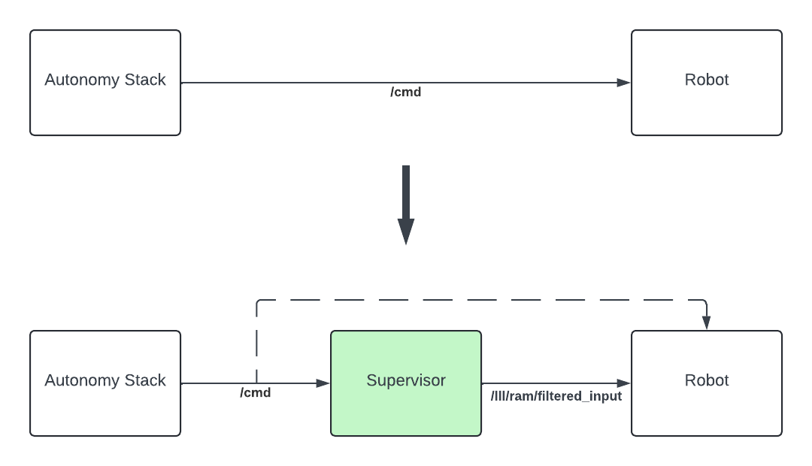

Getting started
#####################################

In its current instantiation, **3Laws Supervisor** supports ground-based mobile platforms (wheeled or legged) with the following movement modalities:

 * Differential-drive
 * Front-wheel steering
 * Omni-directional

For perception, **3Laws Supervisor** currently supports:

 * Raw 2D laserscan data
 * Pre-processed map of obstacles with their locations and shapes

The **3Laws Supervisor** software is a `ROS <http://www.ros.org>`_ node available on x86_64 and ARM-64 processor architectures for multiple OS/ROS combinations:

+-----------------------+--------------+---------------------+
| Ubuntu Distribution   | ROS1 version |    ROS2 version     |
+=======================+==============+=====================+
|        22.04          |     N/A      |     Humble/Iron     |
+-----------------------+--------------+---------------------+
|        20.04          |     Noetic   |     Galactic/Foxy   |
+-----------------------+--------------+---------------------+

.. _Installation:

1. Install
**********

To install Supervisor on the system, open a terminal and run the following command:

.. code-block:: bash

  bash <(curl https://raw.githubusercontent.com/3LawsRobotics/3laws/master/install.sh)

This will run a script to auto-detect the system achitecture, install any missing dependencies, download the right binary, and give you through any necessary configuration steps.

.. important::

  A *sudo* permission may be asked to run APT and install the software.

.. note::

  The ROS packages are installed into the global ROS installation directory. You may have to source the ROS setup script to make the new components available in the current terminal: ``source /opt/ros/<DISTRO>/setup.sh``.

2. Start the control Panel
**************************
Before the Supervisor can be started, in must be configured. In order to configure it, a web-based Control Panel is provided.

To enable the Control Panel backend service, open a terminal and run the following command:

.. code-block:: bash

  3laws control-panel autostart enable

.. note::
  See :doc:`CLI reference <user_guide/cli>` for more options to start the control panel.

3. Configure the Supervisor
***************************

Now that the Control Panel backend is up and running, you can access the control panel from any machine on the same network as the robot by opening a web browser and navigating to the following URL: ``http://<IP_ADDRESS_OF_THE_ROBOT>:8080/``.

The initial view of the Control Panel is the "Configuration" page, which consists of sections (tabs) listed as **Credentials**, **Robot Model**, **Supervisor**, **Localization**, and **Perception**.

.. warning::

  The entire configuration needs to be completed before starting the Supervisor software. If a part of the configuration is missing, the associated tab will be orange in color. Once the configuration is complete all tabs should be white.

.. note::

  See :ref:`Control Panel reference <control_panel_config>` for more details on the configuration options.

.. note::

  The Supervisor does not have to run during the configuration step. It loads the configuration file at start-up, so it needs to be started **after** the configuration is created/updated.

4. Interface with your stack
*****************************

In order to perform collision avoidance maneuvers, the Supervisor must be able to send commands to your robot actuators. These commands will be published on the ``/lll/ram/filtered_input`` topic.

Your low-level controller therefore need to subscribe to this topic and apply the commands to your robot:

5. Launch
*********

To launch the Supervisor directly, use the following command:

.. tabs::
   .. tab:: ROS1
     .. code-block:: bash

       roslaunch lll_supervisor supervisor.launch

   .. tab:: ROS2
     .. code-block:: bash

       ros2 launch lll_supervisor supervisor.launch.py

To include the Supervisor as part of your launch file, use the following code snippets:

.. tabs::
   .. tab:: ROS1
     .. code-block:: xml

       <include file="$(find lll_supervisor)/launch/supervisor.launch">
         <arg name="log_level" value="info"/>
       </include>"

   .. tab:: ROS2
     .. code-block:: python

       from launch.actions import IncludeLaunchDescription
       from launch.launch_description_sources import PythonLaunchDescriptionSource
       from launch.substitutions import PathJoinSubstitution

       # launchDesc = LaunchDescription()

       launchDesc.add_action(
           IncludeLaunchDescription(
               PythonLaunchDescriptionSource(
                   PathJoinSubstitution(
                       [
                           get_package_share_directory("lll_supervisor"),
                           "launch",
                           "supervisor.launch.py",
                       ]
                   )
               ),
               launch_arguments={
                   "log_level": "info",
               }.items(),
           )
       )

6. Monitor your system (optional)
*********************************

The control panel provides an "Operation" page that can be used to monitor the status of the Supervisor working alongside your stack.

.. image:: data/cpanel6.png
  :align: center
  :width: 600px
  :alt: Operations page showing a configured robot that does not yet have sensor or planning data.

|

For that to work, the Supervisor and the Control Panel backend must both be running, and a `rosbridge websocket <https://github.com/RobotWebTools/rosbridge_suite>`_ must be running on the same network as the Supervisor.

To install the rosbridge suite, run the following command:

.. code-block:: bash

  sudo apt-get install ros-<DISTRO>-rosbridge-suite

To start the rosbridge websocket, run the following command:

.. tabs::
   .. tab:: ROS1
     .. code-block:: bash

       roslaunch rosbridge_server rosbridge_websocket.launch

   .. tab:: ROS2
     .. code-block:: bash

       ros2 launch rosbridge_server rosbridge_websocket_launch.xml

.. important::

  Make sure to specify the rosbridge websocket IP address and port in the control panel:

  .. image:: data/cpanel7.png
   :align: center
   :width: 600px
   :alt: Operations page showing a configured robot that does not yet have sensor or planning data.

.. note::

  See :ref:`Control Panel reference <control_panel_ops>` for more details on the operation page.

7. Update (optional)
********************

You can check for updates to the Supervisor by running the following command:

.. code-block:: bash

  3laws check-update

To update the Supervisor, use the same command as for the installation:

.. code-block:: bash

  bash <(curl https://raw.githubusercontent.com/3LawsRobotics/3laws/master/install.sh)

.. note::

  The supervisor will be updated to the latest version available for the system's distribution. The **existing configurations will not be modified**, but if new variables need to be configured, advisories will be given during the installation.

8. What's next?
****************

Next, go read our :doc:`User Guide<user_guide>` to discover everything the supervisor can do for you.
