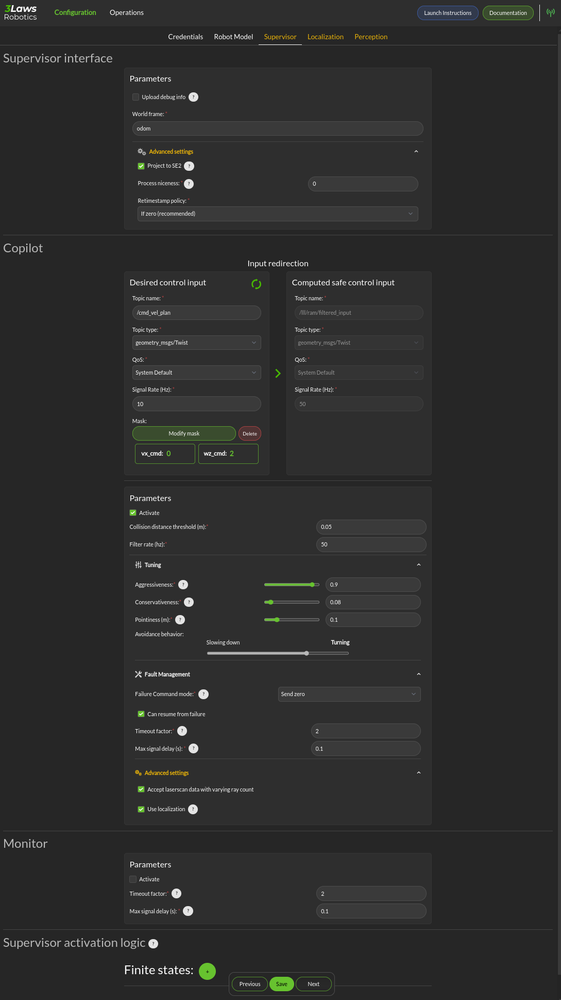

Getting Started
###############

This guide will help you install and configure the 3Laws Supervisor on your robot.

3Laws Supervisor is designed for installation on Ubuntu systems with ROS1 or
ROS2 already deployed on the computer.  The Supervisor is roughly made up of 3 functionalities that are discussed in this manual:

#. Robot diagnostics monitoring (RDM) collects metrics about the system operation in real time.  Some of the threshold violations are published in real-time locally, and some are published only in aggregated fashion. The published messages can be sent to a cloud-based dashboard server or can be used locally for decision making by customer software.

#. Run-time assurance (RTA) or "Copilot" is a "safety filter" that takes the information about collision threshold violations from the diagnostics monitor and produces corrective actions to keep the robot away from the possible collision.  By default, this capability is no active.

#. Control Panel: A configuration graphical (browser-based) tool is available to help set the Supervisor up for the robot.
   

.. contents:: Table of Contents
   :depth: 2
   :local:

1. Installation
***************

To install Supervisor on your system, open a terminal and run the following command:

.. code-block:: bash

  bash <(curl https://raw.githubusercontent.com/3LawsRobotics/3laws/master/rdm/install.sh)

This script will download a package from github and will begin the installation.Note that the package name starts with "lll-rdm". The "lll" represents 3Laws. The product's original name was Robot Diagnostics Module. As the script proceeds it will try to determine your system's configuration so that the appropriate components are installed. The script will prompt you for help with configuration if it is unable to find your computer's ROS distribution or architecture.

During the execution of the script, several questions will be asked:
#. A request to confirm the desire to download the package.

#. Confirmation of the desire to install the package.

#. A *sudo* password to be able to install to shared folders (/opt/ros).

#. Confirmation of the desire to *download* the optional Control Panel component which is designed to make the configuration process easier.

#. Confirmation of the desire to *install* the optional Control Panel component.

The script will add components to the global ROS installation.  These new
components will not be available until the ROS paths are updated. If your configuration automatically runs the ROS setup script when a new shell is started, please close the terminal and open a new one.  Otherwise, please run the following command:

.. code-block:: bash

  source /opt/ros/<DISTRO>/setup.sh

The Supervisor will now be available for operation.

2. Configuration
****************

The 3Laws Supervisor is able to support several different types of robots and it
needs to connect to your system's data sources and sinks.  The configuration process aims to specify this type of information.

A graphical (browser-based) configuration tool (called **Control Panel**) is
available to help with the configuration effort.

After installation open a browser window and navigate to the address `http://localhost:8000`.
If this window does not appear, please manually start the Control Panel server
with the command:

.. code-block:: bash

  sudo systemctl start lll_control_panel

The Control Panel's capabilities can be augmented through a rosbridge server.
With that server, the control panel can more easily display some real-time
information about the Supervisor's status.  To install and start a rosbridge
server (where <rosdistro> is replaced with the version of ROS on your system):

.. code-block:: bash

  sudo apt-get install ros-<rosdistro>-rosbridge-server
  ros2 run rosbridge_server rosbridge_websocket

This will provide a websocket server at `ws://localhost:9090` that the control panel can connect to in order to retrieve topics and services information.

The initial of the Control Panel is the "Configuration" page, which consists of sections (tabs) listed as *Credentials*, *Robot Model*, *Supervisor*, *Localization*, and *Perception*.

Credentials
===========

The *Credentials* page is displayed here:

.. image:: data/cpanel1.png
   :width: 800px
   :alt: Configuration > Credentials: Control Panel page presenting Credentials, Robot name, and Company ID

The 3Laws Supervisor is designed to work in conjunction with a cloud-based server.  When you purchase the Supervisor, 3Laws will provide you with the
credentials to connect to the web-based server and with the official company
name that is used for your serivces.

- **Credentials**: 3Laws will provide you with an Influx Key and a ClickHouse key so that your robot can connect to the cloud-based server and can send its summarized information for display through Grafana.
- **Robot Name**: This identifier will be different for each robot where you install Supervisor.  It should contain a name you can use to identify an individual robot.
- **Company ID**: As part of the registration process, your company's name will be used to create an account on the cloud server. Please make sure that the name matches what 3Laws used to create your account.  This name is used for logging into the cloud server.

The upper-right of the display contains the Rosbridge connection status (upper right), configuration for the Rosbridge (gear next to the status), and a link to this documentation.  There is an "Update Instructions" link in the lower right that brings up a reminder of the instruction to run the installer script.

The **Save** button on each page of the Control Panel should be pressed before moving on to another page.

Robot Model
===========
The Configuration page for the Robot Model is where the robot's geometry and kinematics are specified.

.. image:: data/cpanel2.png
   :width: 800px
   :alt: Configuration > Robot Model page where the kinematics and geometry are specified. 

Throughout this documentation, a red asterisk (*) indicates a *required* field.
  
- **Robot Type**: Supervisor currently supports differential drive, front-steered, and omni-directional mobile platforms.  A differential drive vehicle can rotate around a fixed location by driving one wheel forward and its pair in reverse. It can move forward or backwards by driving both wheels in the same direction.  A front-steered vehicle operates like a car or bicycle. It can move forwards or backwards, but direction is controlled by steering, and the vehicle has a fixed wheelbase distance between the forward axle and the rear axle. An omni-directional robot is usually implemented using wheels that have a series of smaller wheels mounted at 45 degrees on the outer rim.  By moving one axle forward and others backwards, the vehicle can move sideways. Rotation can be effected by moving the wheels on one side forwards and the wheels on the other side in reverse. 
- **Frames and Shapes**: The vehicle's reference frames and geometry are specified in this section.

  * Frames: The name of the robot base frame must be specified here. Additional static frames can be defined by clicking the + icon. The additional frames are static, and will follow the motion of the base robot frame.

  * Shape: The robot's shape is used in order to calculate the distance between the outer boundaries of the robot body and any scan points.  Basic shapes that are currently supported include sphere, box, capsule, point, cone and cylinder.  The size entries change based on the selected shape. Cylinders and capsules both require length and radius. The difference is that a capsule will have hemispheres on the ends while the cylinder ends are flat. A box frame consists of x-length, y-length, and z-length.

   * Shape Pose in Robot Frame: The relative orientation of the robot's shape with respect to the base frame needs to be specified. Note that the rotation can be specified either using quaternions or Euler angles. The quaternion order is w, x, y, z.  When Supervisor is running, it is a good idea to run rviz (or rviz2) to display the orientations and frames.

- **Dynamics**: The Dynamics section has 3 subsections: Input, Parameters, and State.
  
  * The Input section supports specification of maximum and minimum limits for the translational and rotational speeds at which the robot can be commanded. For monitoring, if these values are exceeded, an event to this effect will be issued. If the RTA/Copilot component is active, these limits will be applied to the filtered outputs. For steered vehicles, instead of limits on rotational speeds, steering limits are specified.

  * Parameters: The only robot type that has inputs in the parameters section is the steered robot. *wheel_dx* is the wheelbase length for the vehicle. *origin_x* is the distance from the rear axle to the robot base frame.

  * State: For all robot types, the State category provides the definitions of the variables that are considered as the "states".  These definitions are important when trying to create "masks" to map between the input ROS variable types and the robot states.  The first, is considered state 0 (typically x position), the second is state 1 (typically y position) and the third is state 2 (typically yaw).

Remember to save each page after inputing the data.

Supervisor
==========

The Configuration > Supervisor page contains configuration entries for both the RDM (monitor) and RTA (Copilot) components.

- **Basic configuration**: To enable broadcasting of the aggregated statistics to the cloud account, select the *Upload metrics to cloud database" box.

  * World Frame: Similar to "base robot frame", the name of the world frame (typically *odom* or *map*) must be specified.
    
    * Advanced Settings: Max delay (s) and Timeout Factor are thresholds for triggering events informing that data failed to arrive (if data is not received for max-delay * timeout-factor seconds.  If the copilot (run-time assurance) is active, failure to receive robot state or desired control input (in timeout factor * 1/signal-rate) will cause the copilot to switch to the Failure Command Mode (which is explained below).
  * Copilot : The Copilot enables the run-time assurance capability where desired commands to the robot from the autonomy stack ("desired inputs") are modified in order to avoid collisions, and altered versions are published through a separate message. 
    
    * Activate: This checkbox controls whether the run-time assurance intercepts and modifies commands from the planner/trajectory generator and forwards modified versions to the vehicle. The Copilot will only modify the outputs if the option is activated.  If it is not activated, the unmodified "desired control input" will be transmitted on the designated "Computed safe control" message. 
      
    * Aggressiveness: This parameter controls how far from the nearest obstacle the safety filter starts having more effect on the commands and how strongly the safety filter pushes the robot back into the "safe" region if the safety definition has been violated.  A larger value means that the control inputs from the planner will start to be modified when the robot is farther from an object/obstacle.  In general this will produce larger margins.  A larger value also means that if an obstacle is detected within the collision distance, the command modified by the run-time assurance will try to move the robot away from the object more aggressively.  Typical values are between 0.5 and 1.0, but values in the range of 1000 might be used in reasonable situations.  A smaller value means that the the robot will get closer to the obstacles (higher performance) before being diverted. 

 The following are under the "Advanced Settings".  If the Copilot is activated, these should be customized:

      * Failure Command Mode: The run-time assurance constantly monitors to ensure that it has enough data to determine whether the robot is in a safe condition. The minimum data required is the vehicle state, the laser scan values, and the commanded/desired input.  If any of these is missing the RTA can switch to the failure command mode:

        * Send Zero:  In this mode the run-time assurance commands zero speed and zero turn/rotation in order to bring the vehicle to a stop.

        * Do not Publish:  Another option is to stop publishing values.  This option should only be used if the robot has its own mechanism to put itself in a safe condition if it is not receiving commands.

      * Yield on failure:  This checkbox is like the "Send Desired" option.  Setting this checkbox will override the failure control mode and just forward the "Desired control input" unmodified.
      * Can resume from failure: With this checkbox filled in, once the input data (control input, laser scan, and state) values start appearing after a failure, the robot will be commanded back into motion (if the desired control input is asking for that).  If the box is unchecked once there is a failure, the robot will remain stopped until the Supervisor is restarted.

      * Use localization:  Supervisor provides a MarkerArray that displays the robot's bounding box and rays to the closest obstacles.  If "Use Localization" is set, the display is created relative to the world frame.  In situations where the localization may be less reliable, this checkbox can be deselected, and the visualization will be based on the current robot base frame.

      * Accept wrong size laserscan: One of the checks that is made on the incoming data is that the laserscan is delivering the expected number of scan points each frame. However, there are many laser scanners that are not consistent in the number of scan points they deliver.  Checking this option allows for laser scanners with non-constant number of scan points reported.

      * **Collision distance threshold**:  This is one of the most important values to set. This defines the distance between the edge of the robot and the nearest scan at which safety exists.  If the measured distance drops below this value, the system is considered to be in an "unsafe" configuration.

      * Filter rate (hz): The frequency at which the run-time assurance publishes outputs.  It is recommended that the run-time assurance run at the same rate as the desired control input or at a faster rate.

      * Conservativeness: A factor that specifies how much uncertainty the robot operator thinks there is in the localization and sensor data.  The ratio between aggressiveness and conservativeness is the main controller of the behavior.  Values below 0.1 are recommended.

- **Copilot input interception**: This section relates to republishing the control commands to the robot that are being sent from the autonomy stack.  The values will be published on the *lll/metrics/high_frequency/safe_control_inputs* channel if the Copilot is activate or not.  However, the values will only be different from the *Desired control input* if the Copilot is active.

  * Desired control Input: This is the commands requesting speed and rotation (or speed and steering) that the autonomy stack is publishing. The ROS message type is needed so that the RDM knows what to monitor in order to calculate the barrier function value. The message quality and receipt rate are monitored as part of the aggregated metrics, and if it fails to arrive within the expected time [1/(signal rate) * Timeout factor], an event will be created and the Copilot will transition to the failure command mode.

  * Safe Control Signal: The right side of this area is purely informational. However, if the robot is to be controlled by the run-time assurance signal, it needs to subscribe to the message that is presented here.

- **Supervisor activation logic**:

  * Finite States are messages that the Diagnostics can listen to and issue events when the value of the finite state matches a predefined value.  This could be useful to provide notifications, for example, as the temperature of a component or process reaches predefined values.  If the temperature goes too high or too low, the time at which the threshold is reached may be of interest.  Keep in mind that if a value changes too rapidly, it might pass through a single value too quickly to be detected at that value, so in some cases it may make more sense to use an integer representation of the variable.   Internally, the diagnostic converts the measurand and the threshold to strings for comparison.

Localization
============

Dialogs to connect to the state information provided for the robot and for configuring alerts based on state are on the Configuration > Localization page. contains configuration entries for both the RDM (monitor) and RTA (Copilot) components.

.. image:: data/cpanel4.png
   :width: 800px
   :alt: Configuration > Localization page where monitoring of the vehicles location/state is configured. 

- **Localization topic**: The connection to the ROS state topic is configured in this area. As with input commands, the message topic name, message topic type, expected message topic quality, and expected message rates are specified. If the message quality fails or the message receipt rate is not met, the monitor will issue alerts, and the Copilot will switch to the Failsafe strategy.  The mask needs to be customized if the localization topic is a vector of values that is not a standard ROS message.  The index in the input vector relating to the individual states (x, y, yaw) nees to be set correctly. 

- **Robot state constraints**: Limits on the absolute location (relative to the origin of the world frame) and limits on the measured rates of change (with respect to time) of the vehicle state are set in this area in order to trigger events and alerts for the monitoring function.  The "no bounds" option allows infinite travel in the respective directions or speeds.
    

Perception
============

The collision avoidance depends mostly on the Configuration > Perception dialog where the connection and description of either a laserscan sensor or an obstacle map message is configured.  

.. image:: data/cpanel5.png
   :width: 800px
   :alt: Configuration > Perception page: The laserscan or list of obstacles is configured here. 

- **Laserscan sensor**: The Supervisor can handle data points from one 2-dimensional laser (LIDAR) scanner.

  * Display name: A user-specified name can be provided so that diagnostic information can quickly be understood.

  * ROS Topic: The ROS message name, topic type, quality of service and Signal Rate must all be specified so that the Supervisor can subscribe to the sensor data.

  * Specs:  The expected number of points per scan along with the first (typically minimum) and last (typically maximum) angle must be specified so that the angular resolution can be calculated for the nominal case. The first and last angle values should normally describe a laser that scans in the clockwise direction, so the first is smaller than the last. However, if the laser scans in the counter-clockwise direction the first angle should be set to be smaller than the last.  It is very important that the total range of the laser is less than 2π.  The Supervisor does not disambiguate angles if the total field is larger than 2π.  The scanner's range can be set so that readings smaller than the minimum or larger than the maximum are discarded.

  * Laserscan Pose: The orientation and position of the laserscan relative to the vehicle body or whichever frame is used must be specified. As with the robot's body position, the user is advised to plot the data in rviz to ensure that the geometry is set correctly.

- **Obstacle Map**: An existing perception system can be used instead of a 2D-LIDAR, but it most provide an ObjectArray that matches the definition for an lll_rsgs/ObjectArray.  The definition is as follows:

  std_msgs/Header header
  Object[] objects

where Object[] is defined by:
  std_msgs/Header header

  # Identifier of the object
  string id

  # Object geometry, and pose of geometry in object frame
  ObjectGeometry geometry

  # Object pose world frame
  geometry_msgs/PoseWithCovariance pose
  # Object velocity in object frame
  geometry_msgs/TwistWithCovariance velocity

  # Object behavior model
  ## Bounds on object frame velocity (considered inactive if non finite)
  geometry_msgs/Twist velocity_upper_bounds
  geometry_msgs/Twist velocity_lower_bounds
  ## Bounds on object frame velocity norms (considered inactive if strictly less than 0)
  float64 linear_velocity_norm2_bound
  float64 angular_velocity_norm2_bound
  ## Bounds on object frame acceleration  (considered inactive if non finite)
  geometry_mix's/Accel acceleration_upper_bounds
  geometry_msgs/Accel acceleration_lower_bounds
  ## Bounds on object frame acceleration norms (considered inactive if strictly less than 0)
  float64 linear_acceleration_norm2_bound
  float64 angular_acceleration_norm2_bound

3. Launch
*********

Before starting the supervisor be sure to have your ROS environment correctly set up and sourced.

.. code-block:: bash

  source /opt/ros/<DISTRO>/setup.sh

To launch the Supervisor, use the following command:

.. code-block:: bash

  ros2 launch lll_rdm rdm.launch.py

4. Operations
*************

If the websocket (rosbridge) is running along with the supervisor, the Control Panel's *Operations* tab can be used to obtain a quick overview of the status of the copilot.  

.. image:: data/cpanel6.png
   :width: 800px
   :alt: Operations page showing a configured robot that does not yet have sensor or planning data.

In the image above, the Supervisor is operational and the Copilot is configured to be active as indicated by the arrows between them.  However, these boxes are colored yellow/gold, indicating that they are still initializing.   The framed section above the diagram shows the activity status for some of the critical components:

* The model is healthy (green check).

* The Supervisor in unhealthy/initializing (gold).

* Localization is also unhealthy/initializing (gold).

* Perception is reported as healthy.

The lower section of the panel is showing strip charts.  The categories that are currently displayed represent:

* the State Safeness - the barrier function value.  When this value goes to zero or below zero, the system is evaluated as being in a collision state.

* the Input Modification status - When this value is zero, the copilot is not modifying the input from the autonomy stack. That is, the filtering is in passive mode.  When this value is non-zero, it means that the copilot is actively modifying the commanded input.

* Assurance violation represents that during the process of solving to find the closest input to the desired one, assumptions in the model or uncertainty had to be violated in order to produce a valid solution.  In this case the copilot is producing the best input to bring the system to the desired set, but the guarantees that the system is in the desired region and will remain there no longer hold.
