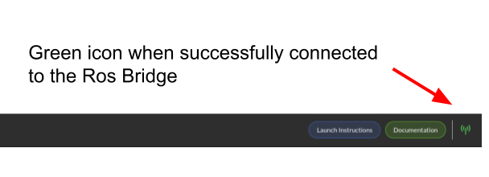
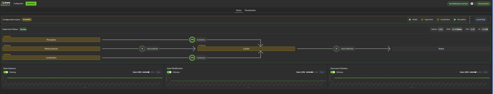

Supervisor Installation and Operation
#####################################

3Laws Supervisor is designed for installation on Ubuntu systems with ROS1 or ROS2 already deployed on the computer. The Supervisor has 3 main functionalities that are discussed in this manual:

#. **Run-time assurance or "Copilot"** operates as a filter that takes the information about collision threshold violations from the diagnostics monitor and produces corrective actions to keep the robot away from the possible collision. By default, this capability is active.

#. **Robot diagnostics monitoring** collects metrics about the system operation in real time. Some of the threshold violations are published in real-time locally, and some are published only in aggregated fashion. The published messages can be sent to a cloud hosted database and visualize via web-based dashboards or can be used locally for decision making by customer software.

#. **Control Panel** is a graphical (browser-based) configuration tool to set up the Supervisor for the robot.

.. contents:: Table of Contents
   :depth: 2

.. _Installation:

Installation
***************

To install Supervisor on your system, open a terminal and run the following command:

.. code-block:: bash

  bash <(curl https://raw.githubusercontent.com/3LawsRobotics/3laws/master/install.sh)

This script will download a package from github and will begin the installation. Note that the package name starts with "lll-supervisor". The "lll" represents 3Laws. As the script proceeds it will try to determine your system's configuration so that the appropriate components are installed. The script will prompt you for help with configuration if it is unable to find your computer's ROS distribution or architecture.

During the execution of the script, several questions will be asked:

#. A request to confirm the desire package to download.

#. Confirmation to install the package.

#. A *sudo* permission may be ask to run APT and install the software.

The script will add components to the global ROS installation. These new components will not be available until the ROS setup script is source. If your configuration automatically runs the ROS setup script when a new shell is started, please close the terminal and open a new one. Otherwise, please run the following command:

.. code-block:: bash

  source /opt/ros/<DISTRO>/setup.sh

At this point, the Supervisor is installed on the system, but needs a configuration file (*~/.3laws/config/supervisor.yaml*).  The configuration file can be built using the browser-based **Control Panel** visual interface discussed below.

Command Line Interface (CLI) for the Control Panel
******************************************************

The Supervisor package provides a CLI that can be used to interact with the Supervisor.

The command for the CLI is `3laws`. It can be used to start, stop, and restart the control panel service used for the configuration of the Supervisor.

The CLI provides also a command to check for updates of the Supervisor. (These updates still have to be installed manually. See: `Version Update`_)

Run the following command to see the available commands:

.. code-block:: bash

  3laws --help-all

After installation you can use the CLI to start the Control Panel:

.. code-block:: bash

  3laws control-panel run

If you prefer using a service to run the Control Panel in the background, you can use the following command:

.. code-block:: bash

  3laws control-panel autostart enable

This will create a user service. This one will be started automatically when the system boots up. The Control Panel will be available at `http://localhost:8080`. If you want to change the port, you can use the following command:

.. code-block:: bash

  3laws control-panel autostart enable --port <PORT>

To turn off the service so that the Control Panel service is removed from the system:

.. code-block:: bash

   3laws control-panel autostart disable

The Control Panel can also display a summary of operational conditions, but this capability requires a rosbridge server. To install and start a rosbridge
server (where <rosdistro> is replaced with the version of ROS on your system):

.. code-block:: bash

  sudo apt-get install ros-<rosdistro>-rosbridge-server
  ros2 run rosbridge_server rosbridge_websocket

This will provide a websocket server at **`ws://localhost:9090`** that the control panel can connect to in order to retrieve topics and services information.

The navigation bar of the control panel will show the status of the rosbridge server connection:

Configuration through the **Control Panel** visual interface
************************************************************

The 3Laws Supervisor is able to support several types of robots, but needs to connect to your system's data sources and sinks. The configuration process aims to specify this type of information. The Supervisor does not have to run during the configuration step. It loads the configuration file at start-up, so it needs to be started **after** the configuration is created/updated.

The initial view of the Control Panel is the "Configuration" page, which consists of sections (tabs) listed as **Credentials**, **Robot Model**, **Supervisor**, **Localization**, and **Perception**. The details of the contents of each of these pages are linked below.

.. toctree::

   1. License key and Robot Name <configuration/credentials>
   2. Robot Shape/Kinematics and Command Inputs <configuration/robot_model>
   3. Copilot tuning and Additional States to Monitor <configuration/supervisor>
   4. Localization state and Constraints on State <configuration/localization>
   5. Sensor Configuration for Collision Avoidance <configuration/perception>

.. important::

  The entire configuration needs to be completed before starting the Supervisor software.

.. important::

  Remember to save each page after updating the data.

Launch
*********

Before starting the supervisor be sure to have your ROS environment correctly set up and sourced.

.. code-block:: bash

  source /opt/ros/<DISTRO>/setup.sh

To launch the Supervisor, use the following command:

.. code-block:: bash

  ros2 launch lll_supervisor supervisor.launch.py

Remapping of the supervisor output signal can be done by adding (for example) the highlighted lines to the */opt/ros/<ros-distro>/share/lll_supervisor/launch/supervisor.launch.py* file:

.. code-block:: python
   :emphasize-lines: 18,19,20

    launchdesc.add_action(
        Node(
            package=PACKAGE_NAME,
            namespace=NAMESPACE,
            executable=EXECUTABLE,
            output=OUTPUT,
            emulate_tty=True,
            parameters=[
                {
                    "use_sim_time": LaunchConfiguration("use_sim_time"),
                    "config_filepath": LaunchConfiguration("config_filepath"),
                    "robot_id": LaunchConfiguration("robot_id"),
                    "log_level": LaunchConfiguration("log_level"),
                    "dry_run": LaunchConfiguration("dry_run"),
                    "log_filepath": LaunchConfiguration("log_filepath"),
                },
            ],
            remappings=[
              ('/lll/ram/filtered_input', '/cmd_vel'),
            ],
            arguments=["--ros-args", "--disable-stdout-logs"],
        )
    )

Additional topics published by Supervisor
********************************************

The Supervisor publishes a number of topics that can be used to visualize the data that it is collecting.
published via ROS this topic can be visualized using RViz or directly from the shell.
A detailed list of the topics published by the Supervisor can be found here:

.. toctree::

    details/topics

.. note::

  The topics are published in the namespace `/lll`.

Operations
*************

If the websocket (rosbridge) is running along with the supervisor, the Control Panel's *Operations* tab can be used to obtain a quick overview of the status of the copilot.

In the image above, the Supervisor is operational and all the Copilot is configured to be active as indicated by the arrows between them. When data is not yet available (e.g. rosbridge connection is not operational) the boxes appear as golden. If the component has not yet initialized, the background for the box is blue, while if there is a detected error, the box is red. Proper operation is indicated by a green-colored box.

The lower section of the panel is showing strip charts. The categories that are currently displayed represent:

* the State Safeness - the barrier function value. When this value goes to zero or below zero, the system is evaluated as being in a collision state.

* the Input Modification status - When this value is zero, the copilot is not modifying the input from the autonomy stack. That is, the filtering is in passive mode. When this value is non-zero, it means that the copilot is actively modifying the commanded input.

* Latest logs - shows the most recently detected events.

Version Update
*****************

To update the Supervisor, you can use the same command as for the installation.

The supervisor will be updated to the latest version available for your distribution, **Existing configurations will not be modified**, but if new variables need to be configured, you will be advised during the installation.

.. code-block:: bash

  bash <(curl https://raw.githubusercontent.com/3LawsRobotics/3laws/master/install.sh)

