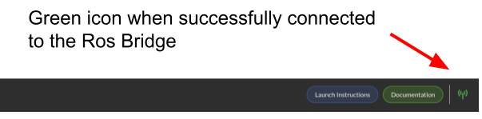
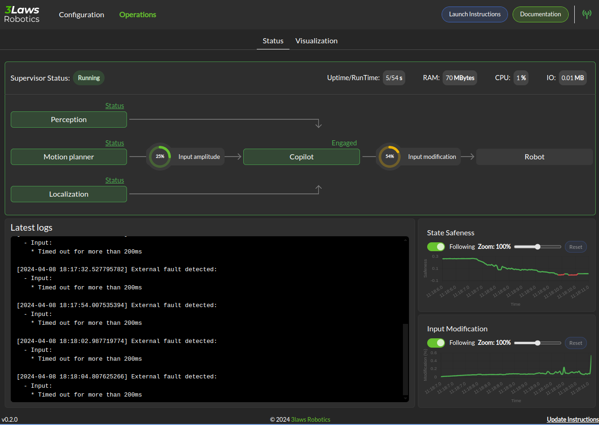

Using Supervisor
################

This page will help you install and configure the 3Laws Supervisor on your robot.

3Laws Supervisor is designed for installation on Ubuntu systems with ROS1 or
ROS2 already deployed on the computer.  The Supervisor is roughly made up of 3 functionalities that are discussed in this manual:

#. Robot diagnostics monitoring collects metrics about the system operation in real time.  Some of the threshold violations are published in real-time locally, and some are published only in aggregated fashion. The published messages can be sent to a cloud-based dashboard server or can be used locally for decision making by customer software.

#. Run-time assurance or "Copilot" operates as a filter that takes the information about collision threshold violations from the diagnostics monitor and produces corrective actions to keep the robot away from the possible collision.  By default, this capability is not active.

#. Control Panel: A configuration graphical (browser-based) tool is available to help set the Supervisor up for the robot.

.. contents:: Table of Contents
   :depth: 2

1. Installation
***************

To install Supervisor on your system, open a terminal and run the following command:

.. code-block:: bash

  bash <(curl https://raw.githubusercontent.com/3LawsRobotics/3laws/master/rdm/install.sh)

This script will download a package from github and will begin the installation.Note that the package name starts with "lll-rdm". The "lll" represents 3Laws. The product's original name was "Robot Diagnostics Module". As the script proceeds it will try to determine your system's configuration so that the appropriate components are installed. The script will prompt you for help with configuration if it is unable to find your computer's ROS distribution or architecture.

During the execution of the script, several questions will be asked:

#. A request to confirm the desire to download the package.

#. Confirmation of the desire to install the package.

#. A *sudo* password to be able to install to shared folders (/opt/ros).

#. Confirmation of the desire to *download* the optional Control Panel component which is designed to make the configuration process easier.

#. Confirmation of the desire to *install* the optional Control Panel component.

The script will add components to the global ROS installation.  These new
components will not be available until the ROS paths are updated. If your configuration automatically runs the ROS setup script when a new shell is started, please close the terminal and open a new one.  Otherwise, please run the following command:

.. code-block:: bash

  source /opt/ros/<DISTRO>/setup.sh

The Supervisor will now be available for operation.

2. CLI (Command Line Interface)
********************************

The Supervisor package comes with a command line interface (CLI) that can be used to interact with the Supervisor.

This CLI is called `3laws` and can be used to start, stop, and restart the control panel used for the configuration of the Supervisor.

The CLI provides also a command to check for updates of the Supervisor. (These updates still have to be installed manually. See: `6. Update`_)

Run the following command to see the available commands:

.. code-block:: bash

  3laws --help-all

1. Configuration
****************

The 3Laws Supervisor is able to support several different types of robots and it
needs to connect to your system's data sources and sinks.  The configuration process aims to specify this type of information.  The Supervisor does not have to run during the configuration step. It loads the configuration file at start-up, so it needs to be started *after* the configuration is created/updated.

A graphical (browser-based) configuration tool (called **Control Panel**) is
available to help with the configuration effort.

After installation you can use the CLI to start the Control Panel:

.. code-block:: bash

  3laws control-panel run

If you prefer using a service to run the Control Panel in the background, you can use the following command:

.. code-block:: bash

  3laws control-panel enable

This will create a user service. This one will be started automatically when the system boots up. The Control Panel will be available at `http://localhost:8080`.  If you want to change the port, you can use the following command:

.. code-block:: bash

  3laws control-panel enable --port <PORT>

The Control Panel's capabilities can be augmented through a rosbridge server.
With that server, the control panel can more easily display some real-time
information about the Supervisor's status.  To install and start a rosbridge
server (where <rosdistro> is replaced with the version of ROS on your system):

.. code-block:: bash

  sudo apt-get install ros-<rosdistro>-rosbridge-server
  ros2 run rosbridge_server rosbridge_websocket

This will provide a websocket server at `ws://localhost:9090` that the control panel can connect to in order to retrieve topics and services information.

The navigation bar of the control panel will show the status of the rosbridge server connection:

The initial view of the Control Panel is the "Configuration" page, which consists of sections (tabs) listed as *Credentials*, *Robot Model*, *Supervisor*, *Localization*, and *Perception*.  The details of the contents of each of these pages are linked below.

.. important::

  The entire configuration needs to be completed before starting the Supervisor software.

.. toctree::

    configuration/credentials
    configuration/robot_model
    configuration/supervisor
    configuration/localization
    configuration/perception

.. important::

  Remember to save each page after updating the data.

1. Launch
*********

Before starting the supervisor be sure to have your ROS environment correctly set up and sourced.

.. code-block:: bash

  source /opt/ros/<DISTRO>/setup.sh

To launch the Supervisor, use the following command:

.. code-block:: bash

  ros2 launch lll_rdm rdm.launch.py

5. Operations
*************

If the websocket (rosbridge) is running along with the supervisor, the Control Panel's *Operations* tab can be used to obtain a quick overview of the status of the copilot.

In the image above, the Supervisor is operational and the Copilot is configured to be active as indicated by the arrows between them.  However, these boxes are colored yellow/gold, indicating that they are still initializing.   The framed section above the diagram shows the activity status for some of the critical components:

* The model is healthy (green check).

* The Supervisor in unhealthy/initializing (gold).

* Localization is also unhealthy/initializing (gold).

* Perception is reported as healthy.

The lower section of the panel is showing strip charts.  The categories that are currently displayed represent:

* the State Safeness - the barrier function value.  When this value goes to zero or below zero, the system is evaluated as being in a collision state.

* the Input Modification status - When this value is zero, the copilot is not modifying the input from the autonomy stack. That is, the filtering is in passive mode.  When this value is non-zero, it means that the copilot is actively modifying the commanded input.

* Assurance violation represents that during the process of solving to find the closest input to the desired one, assumptions in the model or uncertainty had to be violated in order to produce a valid solution.  In this case the copilot is producing the best input to bring the system to the desired set, but the guarantees that the system is in the desired region and will remain there no longer hold.

6. Update
**********

To update the Supervisor, you can use the same command as for the installation.

The supervisor will be updated to the latest version available for your distribution, **Existing configurations will not be modified**, but if new variables need to be configured, you will be advised during the installation.

.. code-block:: bash

  bash <(curl https://raw.githubusercontent.com/3LawsRobotics/3laws/master/rdm/install.sh)

