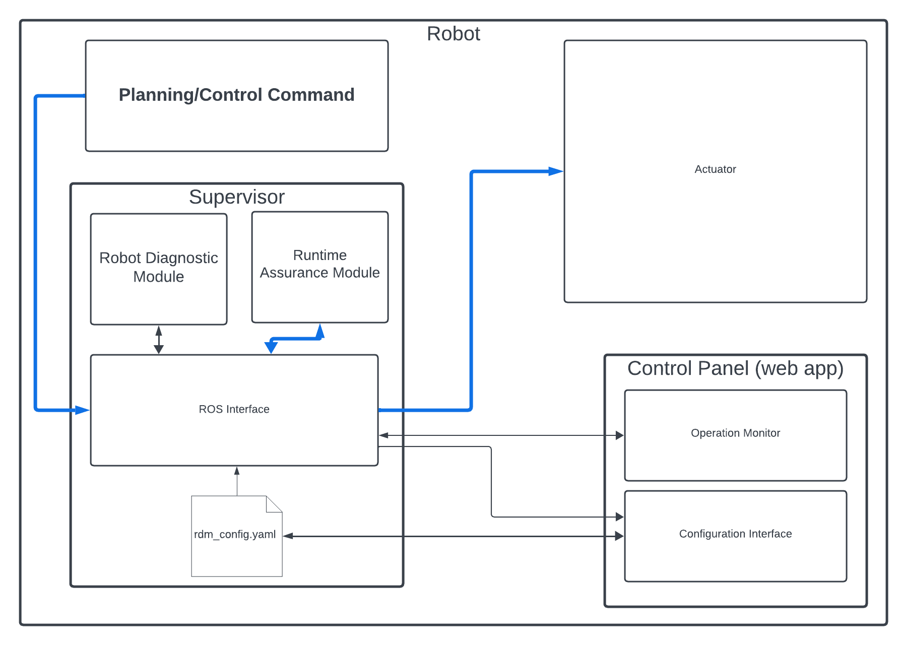
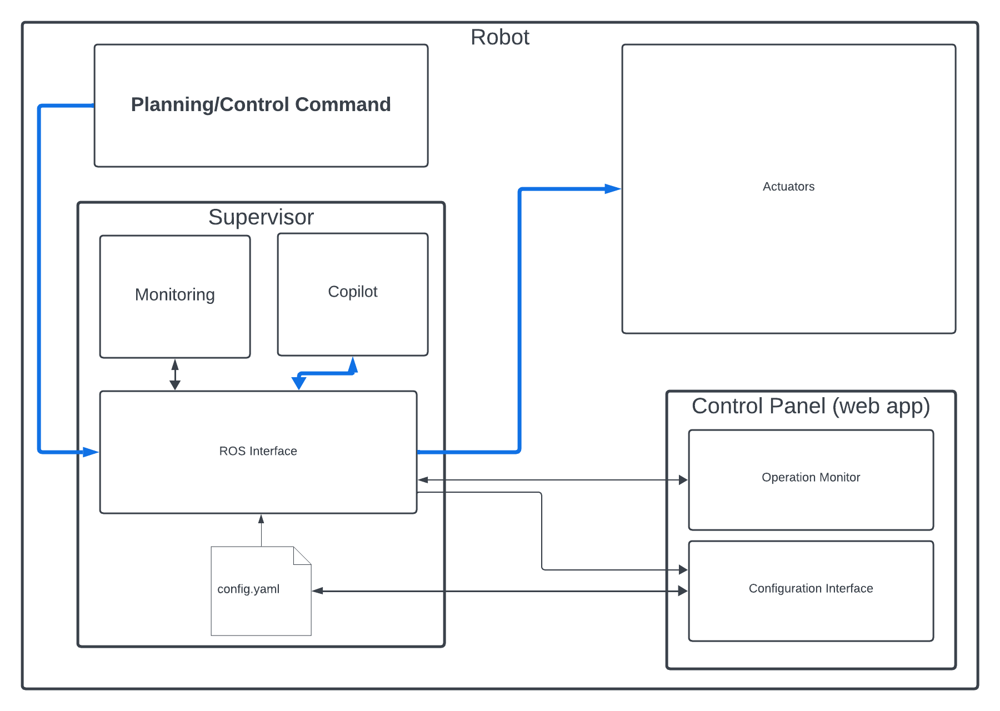

User Guide
###########

.. toctree::
  :maxdepth: 2
  :hidden:

  Run-time assurance <user_guide/runtime_assurance>
  Robot diagnostics <user_guide/diagnostics>
  Control Panel <user_guide/control_panel>
  Ros Interface <user_guide/ros_interface>
  CLI <user_guide/cli>

Introduction
============

The **3Laws Supervisor** is a software-based layer providing reliable and high-performance sense-and-avoid capabilities for a variety of robotic platforms. Its role is to provide a failsafe system that will intervene to prevent collisions when the autonomy stack fails to do so.

The Supervisor is designed to sit between the autonomy stack and the robot's low-level controllers:

Nominally, the Supervisor forwards the desired commands from the autonomy stack to the robot un-altered. However, when the autonomy stack fails in some way, the supervisor will intervene in time and modify these desired commands in a minimally intrusive way to avoid a collision.

The Supervisor is delivered as a single package containing various tools and modules working together toward enabling these sense-and-avoid capabilities:

At the heart of the supervisor is the :ref:`Collision Avoidance Module<user_guide/runtime_assurance>` (CAM). This module is responsible for continuously filtering the desired commands sent by the autonomy stack to the robot in order to prevent unsafe behaviors in a minimally invasive way. In particular, this module is also responsible for the fault management strategy in case a failure of a critical component of the system is detected.

Complementary to the RAM, the supervisor also integrates a :ref:`Robot Diagnostic Module<user_guide/diagnostics>` (RDM). This module is responsible for monitoring the health and safety of various critical sub-systems of the robot. This information is available in the form of metrics being published in real-time on ROS topics. These metrics can be used to better understand the behavior of the robot and to diagnose potential issues.

.. important::
  Currently, the diagnostic performed by the RDM is solely for information purposes and is not connected to the RAM's fault management system.

- :ref:`Control Panel<user_guide/control_panel>`: The Control Panel is an optional web-based application that guides the user through the configuration of the Supervisor and debugging of operations. Based on the data provided by the user, it creates (or updates) a configuration file used by the Supervisor's various capabilities. The Control Panel has some abilities to visualize the robot's safety. This component does not need to be active (or running) during operation of the robot, except as desired for visualizing the metrics available through it.  Once the Supervisor is configured through the Control Panel, turning off the lll_control_panel.service is a reasonable step.

- :ref:`CLI<user_guide/cli>`: The Command line interface

.. _user_guide/runtime_assurance:

Run-time assurance
------------------

The run-time assurance capability, also referred to as **Copilot**, is a filter that operates at the control rate. It is designed to ensure that the robot's control commands keep the robot in a user defined safe state. Based on formal mathematical proven methods, the Copilot is able to prevent the robot from colliding while still allowing the robot to reach maximum performance when the system is far from any obstacles **in its current travel direction**.

This ability allows development of the robot's control and planning algorithms without worrying about collision avoidance.

The Copilot uses basic kinematic and dynamic models for the robot in order to predict potential collisions. Supervisor currently supports differential-drive (able to rotate-in-place and translate), single-track steered, and omni-directional (able to translate sideways in addition to rotations and forward/back motion) vehicles.

.. important::
  For more details, see :doc:`Run-time assurance <user_guide/runtime_assurance>`

.. _user_guide/diagnostics:

Robot diagnostics
-----------------

The diagnostics that monitors and compute metrics about the robot health and safety. The computed metrics are published on ROS topics that are available locally on the robot. High frequency versions of the metrics can be used to monitor the robot's health and safety in real-time. In other words, these metrics are available to other processes on the robot which can then use the information to make decisions.

The metrics are also summarized and optionally sent to a cloud database for display and analysis. 3LawsRobotics cloud dashboards help diagnose issues the robot might have. These Dashboards are made using `Grafana <https://grafana.com/grafana/>`_.

.. important::
  For more details, see :doc:`Robot diagnostics <user_guide/diagnostics>`

.. _user_guide/control_panel:

Signal Remapping
----------------

The most straightforward way to insert Supervisor into an existing command chain is to use the ROS remapping feature as illustrated in the figure below. There is no need to make any changes to the signals published or subscribed-to by the existing components. In the example below, the **/cmd_vel** signal represents the output of the Planner and the input to the Controller. At launch time, the Planner's signal can be remapped to an alternate name like **/cmd_vel_plan**.

.. image:: data/supervisor_insertion_1.png
  :width: 800px
  :alt: Architecture schema

The Supervisor should then be configured (after installation) to subscribe to the **/cmd_vel_plan** signal that is the resulting output from the Planner. The Supervisor's launch file (nominally */opt/ros/<version>/share/lll_supervisor/launch/supervisor.launch.py* should be modified to include the remapping from **/lll/ram/filtered_input** to **/cmd_vel**, which is what the downstream system subscribes to.

For effective operation, the Supervisor needs to be configured. Details for this step are presented in :doc:`Using Supervisor <getting_started>`.

The Control Panel also visualizes operation of the Supervisor's Copilot.

.. important::
  For more details, see :doc:`Control Panel <user_guide/control_panel>`

.. _user_guide/cli:

Command Line Interface (CLI)
----------------------------

.. important::
  For more details, see :doc:`CLI <user_guide/cli>`
