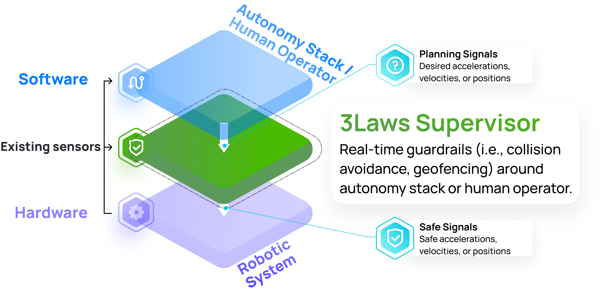
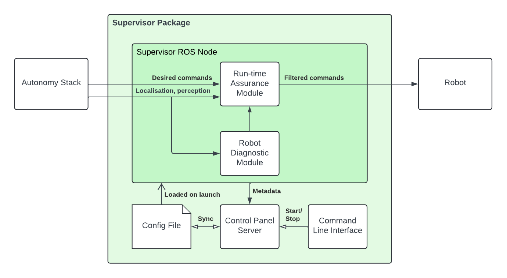

User Guide
###########

.. toctree::
  :maxdepth: 2
  :hidden:

  Run-time Assurance Module <user_guide/runtime_assurance>
  Robot diagnostics <user_guide/diagnostics>
  Control Panel <user_guide/control_panel>
  CLI <user_guide/cli>
  Reference <user_guide/reference>

The **3Laws Supervisor** is a software-based layer providing reliable and high-performance sense-and-avoid capabilities for a variety of robotic platforms. Its role is to provide a failsafe system that will intervene to prevent collisions when the autonomy stack fails to do so.

The Supervisor is designed to sit between the autonomy stack and the robot's low-level controllers:

Nominally, the Supervisor forwards the desired commands from the autonomy stack to the robot un-altered. However, when the autonomy stack fails in some way, the supervisor will intervene in time and modify these desired commands in a minimally intrusive way to avoid a collision.

The Supervisor is delivered as a single package containing various tools and modules working together toward enabling these sense-and-avoid capabilities:

At the heart of the supervisor is the :doc:`Runtime Assurance Module<user_guide/runtime_assurance>` (RAM). This module is responsible for continuously filtering the desired commands sent by the autonomy stack to the robot in order to prevent unsafe behaviors in a minimally invasive way. In particular, this module is also responsible for the fault management strategy in case a failure of a critical component of the system is detected.

Complementary to the RAM, the supervisor also integrates a :doc:`Robot Diagnostic Module<user_guide/diagnostics>` (RDM). This module is responsible for monitoring the health and safety of various critical sub-systems of the robot. This information is available in the form of metrics being published in real-time on ROS topics. These metrics can be used to better understand the behavior of the robot and to diagnose potential issues.

.. note::

  Currently, the diagnostic performed by the RDM is solely for information purposes and is not connected to the RAM's fault management system.

In order for the CAM and RDM to work effectively, they need to be configured with some robot's specific characteristics. This is done through the :doc:`Control Panel<user_guide/control_panel>` (CP), a web-based application that guides the user through the configuration of the Supervisor. Il also provides a way to visualize the robot's safety metrics in real-time.

Finally, the Supervisor Package also contains a :doc:`Command Line Interface<user_guide/cli>` (CLI) that allows the user to manage the Control Panel and Supervisor operations from the command line.

.. important::

  The Supervisor node loads its configuration on launch from a YAML file located at ``~/.3laws/config/supervisor.yaml``. This file is what's updated by the Control Panel but can also be manipulated manually for advanced configuration and backup.

.. important::

  The Supervisor generates a single log file located at ``~/.3laws/log/supervisor.log`` that gets overwritten at every launch. These logs are useful for debugging and monitoring the Supervisor's behavior. If you want to disable this file logging, you can specify an empty ``log_filepath`` ROS parameter on launch.
