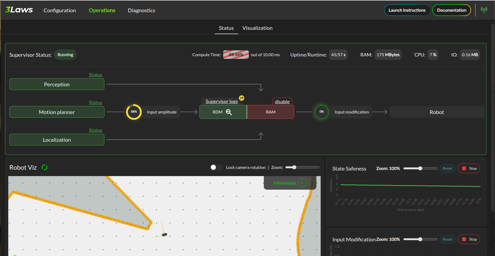

Control Panel
##############

.. contents:: Table of Contents
  :local:

Rosbridge connection
=====================

The Control Panel is most effective when used with a ROS bridge server.

To install a Rosbridge server (where <distro> is replaced with the version of ROS on the system), run:

.. code-block:: bash

  sudo apt-get install ros-<distro>-rosbridge-server

The Rosbridge server can be started with the following command:

.. tabs::
   .. tab:: ROS1
     .. code-block:: bash

       roslaunch rosbridge_server rosbridge_websocket.launch

   .. tab:: ROS2
     .. code-block:: bash

       ros2 launch rosbridge_server rosbridge_websocket_launch.xml

This will provide a websocket server at **`ws://localhost:9090`**. The Control Panel can connect in order to retrieve topic and service information.

The navigation bar of the control panel shows the status of the rosbridge server connection:

.. image:: ../data/navigation_bar_rosbridge.png
  :width: 800px
  :alt: Control Panel NavBar with ros bridge connected.

.. note::

  During the configuration process, the Control Panel can be used without a Rosbridge server, but the autocompletion for topics and the operation tab will not be available.

.. _control_panel_config:

Supervisor Configuration
========================

The Supervisor's configurable fields are available through a series of pages in the Control Panel.  Each of the following sections corresponds to a tab in the Control Panel. The tabs are:

.. toctree::
  :maxdepth: 1

  1. Credentials <configuration/credentials>
  2. Model <configuration/robot_model>
  3. Supervisor <configuration/supervisor>
  4. Localization <configuration/localization>
  5. Perception <configuration/perception>

The **Save** button on each page of the Control Panel should be pressed to record the current page in the *supervisor.yaml* file before moving on to another page.

Throughout this documentation, a red asterisk (*) indicates a *required* field.

.. note::

  The configuration is saved in the `~/.3laws/config/supervisor.yaml` file.

.. warning::

  The Control Panel has a topic autocompletion capability that depends on the Rosbridge server. The robot's stack (without Supervisor) needs to be running and publishing topics for this feature's proper operation.

.. _control_panel_ops:

Control Panel's Operations Page
===============================

|

In the image above, the Supervisor is operational and all the components necessary for proper collision avoidance are configured to be active as indicated by the arrows between them. When data is not yet available to the Control Panel (e.g. Rosbridge connection is not operational) the boxes appear as golden. If Rosbridge is running properly, but the component has not yet initialized, the background for the box is blue, while if there is a detected error, the box is red. Proper operation is indicated by a green-colored box.

The lower section of the panel show logs and strip charts. The categories that are currently displayed include:

* Latest logs - shows the most recently detected events.

* State Safeness: the Barrier Sunction (safety-related metric) value. When this value goes to zero or below zero, the system is evaluated as being in a collision state.

* Input Modification status - When this value is zero, the Run-time Assurance Module is passing the input from the planner through to the lower-level UNchanged. That is, the filtering is in passive mode. When this value is non-zero, the Run-time Assurance Module is actively modifying the commanded input.

.. warning::

  In order to make this page work, the Rosbridge server needs to be active, and the Control Panel must connect to it.
