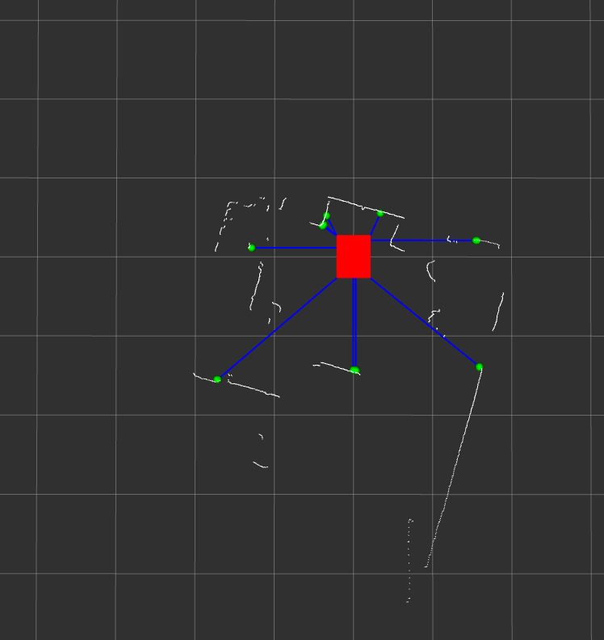

Supervisor ROS messages
########################

Runtime Assurance Module
------------------------

The Supervisor publishes a number of messages that can be used to monitor how the Run-time assurance behaves.

These messages are published on ROS topics and can be used by other ROS nodes. The ROS namespace for these topics is ``/lll``.

The following topics are published by the Supervisor by default:

- ``/lll/supervisor/ping``: A message that is published once per second to indicate that the Supervisor is running. This message contains statistics of the cpu usage, RAM usage, thread count, input/output, network traffic, and logging as used/produced by the Supervisor.

When the CoPilot/Run-time assurance capability is enabled, the following additional signals are published:

- ``/lll/ram/filtered_input``: The filtered velocity command that is sent to the robot's actuators when the Supervisor receives inputs from the planner/upstream.  Note that this signal may be remapped to match the name of the input the downstream systems expects.
- ``/lll/ram/markers``: Visualization tools such as RVIZ and FoxGlove can subscribe to this signal in order to display the illustrated vectors between the robot and obstacles that the Supervisor uses to make decisions on modifications to the input signal.  The image below shows an rviz2 display where the red box represents the robot, the blue vectors represent the vector between a sensed laser point and the closest point on the robot's boundary, and the green dots represent laser scan points that are being actively monitored by Supervisor. These values are all embedded into the ``/lll/ram/metadata``.  The white dots are the 2D laser scan points that are subscribed-to separately.

|

- ``/lll/ram/enable`` is a ROS Bool value that can be use to **command** the activation of the Supervisor.  The Copilot portion of the Supervisor needs to be Activated in order to use this signal.  Setting it to False will deactivate the Copilot filter.

- ``/lll/ram/metadata`` contains significant statistics about the monitor and the filter, particularly notifications of sensed delays, non-finite values, timeouts, data size variations, and initialization for inputs, states, and perception.  It also reports the most recent detected fault, along with several other useful details.

Robot Diagnostic Module
------------------------

The following topics are published by the Supervisor's diagnostics:

- ``/lll/rdm/clock_health_utc``: Statistics reporting variations in the synchronization of the robot clock and Universal time. This presents the current UTC time and real-time-clock value in nanoseconds since 1970, presenting the offset between the two.
- ``/lll/rdm/domain_status``: The summary of the condition of the vehicle is presented in the following fields: system_status, behavior_status, hardware_status, perception_status, and control_status.  When everything is working properly, a status of OK is reported for each.
- ``/lll/rdm/dynamic_consistency``: If a dynamical model has been added to the configuration, this topic will compare the predicted model behavior to the current behavior and provide discrepancy metrics.  Several values including differences in speeds between the platform and the model, and statistics on these differences are provided.  Time since last input and time since last state message are also provided (in nanoseconds).
- ``/lll/rdm/incidents_log``: As events are detected in the system, they are published through this channel as text messages.  The "tags" area of the message includes discrete-value key-value pairs for severity and type of issue.
- ``/lll/rdm/node_health``: Node health provides the status messages from various nodes. For example, the sensor_node provides details of the laserscan including the time since the last message, and average/min/max sending rates, receipt rates, and delays.
- ``/lll/rdm/sensor_noise``: This metric presents statistics on the noise characteristics for the sensors including: average error, maximum error, maximum angle error, and percentage of sigma.  Each data set is tagged with the sensor it corresponds to.
- ``/lll/rdm/sensor_obstruction``: If the monitor detects that the laserscan appears to be obstructed in certain angular sectors, the information about the amount of obstruction is published through this channel.
- ``/lll/rdm/signal_health``: Monitor is constantly checking to see if inputs to the system are reasonable (e.g. are finite, numerical values). If values such as Not-a-Number (nan), purely zero, or infinity are received, the occurrences are reported.
- ``/lll/rdm/systems_health``: Detailed information about the system resource usage is provided through this channel: system_id, cpu_load, ram_usage, disk_usage, network_read, network_write, cpu_nb (core count), and procs_nb (process count).

More precise control can be obtained by editing the *supervisor.yaml* file under the *robot_diagnostics_module* area. The default settings are shown below.

.. literalinclude:: ../data/rdm_data.txt
