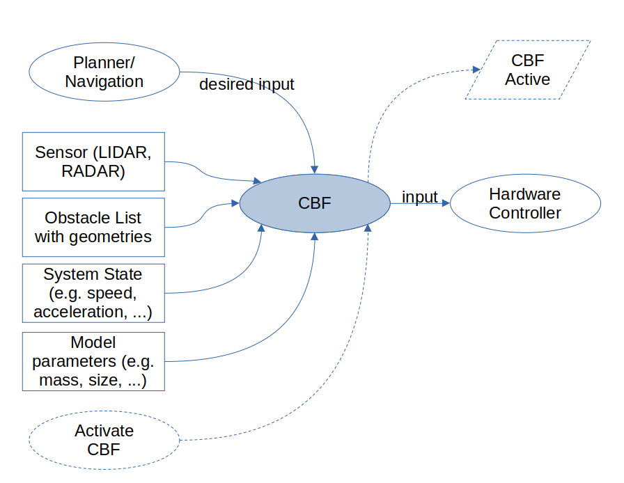

Run-time Assurance
####################

The Run-time Assurance Module (RAM), is a filter that operates at the control rate. It is designed to ensure that the robot's control commands keep the robot in a user defined safe state. Based on formal mathematical proven methods, the CAM is able to prevent the robot from colliding while still allowing the robot to reach maximum performance when the system is far from any obstacles **in its current travel direction**.

This ability allows development of the robot's control and planning algorithms without worrying about collision avoidance.

The CAM uses basic kinematic and dynamic models for the robot in order to predict potential collisions. Supervisor currently supports differential-drive (able to rotate-in-place and translate), single-track steered, and omni-directional (able to translate sideways in addition to rotations and forward/back motion) vehicles.

3Laws has developed the Supervisor as an add-on that can check and augment an existing planner or controller. The Supervisor contains a limited set of vehicle platforms and applications. This document describes the more general possibilities available for the underlying technology known as *Control Barrier Functions* (CBFs). The high-level idea is that CBFs monitor the robot (or other vehicle's) state and next motion commands in real-time. If the model predicts that the system will experience undesirable behavior (based on the commands and system dynamics), then the commands will be altered to avoid the undesirable outcome in a minimally disruptive way. The modification might be to slow the vehicle or to turn it towards a more desirable direction.

The off-the-shelf packaging of Supervisor supports collision avoidance for a selection of robot systems such as unicycle (differential-
drive) and bicycle (front-steering) vehicles. Other operational situations like
geo-fencing or attitude stabilization can be implemented with CBFs as custom behaviors. Similarly, other operational platforms including articulated robots, aerial and marine vehicles (drones), and specialized devices can also be implemented by 3Laws. CBFs can also be used to alert of the need to change the input commands when an unsafe behavior is predicted - an alarm could be sounded. That capability could be applied to human-controlled systems where CBF does not have access to the actuators.

Basic Architecture
==================

From an operational standpoint, a CBF (when used for collision avoidance) sits between the planning layer and the hardware control layer. "Hardware control" typically refers to a speed or attitude controller for a vehicle or a joint attitude/speed controller for an articulated robot.

The CBF will evaluate the likelihood of a collision (or other undesirable behavior) and will only modify the desired input from the planner when a collision is predicted within the estimation window.

There are 2 main steps to integrate a CBF into an existing stack:

  1. Remap the output from the planner (or component that produces commands such as the path to follow, the vehicle speed, or the navigation) and set it as the input to the CBF. Then remap the input of the controller (or component that converts the navigation instructions into hardware/actuator instruction to use the output of CBF. With ROS, for example, the re-mapping can be done in the launch routines.

  2. Start the CBF as part of the stack.

Available Configurations in Supervisor
======================================

The following configurations of robot platform and operational objective are
currently available in the Supervisor. Other platforms/applications are available as custom developments.

+---------------------+---------------------+----------------+
| Robot Configuration | Collision Avoidance |   GeoFencing   |
+=====================+=====================+================+
|       Unicycle      |          Yes        |       No       |
+---------------------+---------------------+----------------+
|   Omnidirectional   |          Yes        |       No       |
+---------------------+---------------------+----------------+
|       Bicycle       |          Yes        |       No       |
+---------------------+---------------------+----------------+
|     Copter Drone    |    in development   | in development |
+---------------------+---------------------+----------------+

In terms of handling the objects in the space, these routines support laser scans and list of obstacles (with geometries). Using lists of perceived obstacles typically results in lower computational loads.

Applications
============

**Active Collision Avoidance**: In the collision avoidance use case, a CBF is designed to modify the planner's outputs in order to prevent impacts between the robot and other actors/obstacles in the operational space. A CBF can be used as a redundant system that filters the planner and only injects changes when a collision is predicted. In many cases, this allows for reducing the load on the planner for calculating paths around obstacles or for using the CBF as a redundant component in the stack, allowing improved reliability calculations by having a dissimilar component that can perform obstacle handling as a parallel task.

A sensor system that detects the presence of the obstacles (e.g. LIDAR, RADAR,
ultra-sonic) is required for collision avoidance. The sensor suite can be
shared with the stack or can be dedicated. (Supervisor currently only supports 2D Laserscans.)

In the case of a human "planner", a CBF can be responsible for avoiding obstacles (assuming they are detected by sensors). Avoidance actions that can be activated in a CBF include stopping, avoiding the obstacle to the left/right, and backing up. Custom actions (such as diverting and parking until a moving obstacle on a known trajectory has passed by) can also be implemented as custom packages.

**Repetitive Path Collision Avoidance**: Using a simulation framework with known
obstacles in the space, CBFs can modify pre-planned paths to avoid potential collisions. The margins between the robot (even for articulated robots) and the obstacles can be adjusted based on estimated uncertainties in the behavior of the robot and of positioning of the fixed objects. The primary use case for this is for systems that perform repetitive tasks.

**GeoFencing**: CBFs can also be inserted into the autonomy stack at different locations based on the needs for time-criticality. The approach is most often deployed between the planner and the inner-loop controller, but it can also be deployed between the inner-loop controller and the hardware for cases where the vehicle, like a racing copter, is going to approach undesirable configurations at rates that the high-level planner is able to replan-for, or if the system is being controlled by a human (or automated planner) that is not aware of the position of the drone relative to the keep-out area.

**Configuration Bounding**:
Control Barriers can be designed to control state variables such as position, speed, and accelerations. This means that configuring the theory to avoid situations such as vehicle roll-over because of large lateral accelerations or sliding because of large accelerations can also be implemented as objectives. Please contact 3Laws for discussions on how these objectives can be made available.

Platforms
=========

The following are a few of the most commonly-used platforms.

**Unicycle** describes a wheeled-ground-based robot with differential drive for steering and coordinated drive for forward/back motion. The vehicle is able to stop and rotate in-place. Configuration parameters include wheel radius, distance between the wheels, vehicle extents, acceleration limits, and speed limits.

**Bicycle** includes vehicles that can be modeled with a single-track rolling model (e.g. car, truck, golf-cart). Current models use front-wheel steering.
Control consists of speed and steering. Configuration parameters include wheel radius, maximum steering angles, effective wheelbase, vehicle extents, vehicle mass, acceleration limits, speed limits, and for faster vehicles, understeer
gradient.

**Omnidirectional** robots can move longitudinally and laterally, often at
the same time.

**Copter:** Flying vehicle that can move and rotate freely in a 3-dimensional
world, but must be upright most of the time to avoid colliding with the ground.
Configuration parameters include vehicle extents, mass, moments of inertia,
acceleration limits, and speed limits.

Theory of Operation
===================

A CBF uses theories from *invariant set* math for the states of systems to create a mechanism to keep the devices away from undesired state configurations (e.g. unsafe areas, unstable configurations). For systems that are controlled through feedback or feed-forward, the desirable state is based on the needs of the operation and what sensing/actuation methods are available. The concept of an *invariant set* is that once the system is within the set, it can be kept within that set by the control or planning signals based on system dynamics. For collision avoidance scenarios, the desired set is space where the distance to the nearest object (and relative approach speed) is maintained sufficiently large. In the case of geofencing applications the desired invariant set is anywhere other than the geofenced region. For a system that may fall over, the desired state might be one where it remains upright.

Theory and practical uses are described in:

Ames, Aaron D., et al. "Control barrier function based quadratic programs for safety critical systems." IEEE Transactions on Automatic Control 62.8 (2016): 3861-3876.

Chen, Yuxiao, et al. "Backup control barrier functions: Formulation and comparative study." 2021 60th IEEE Conference on Decision and Control (CDC). IEEE, 2021.

Gurriet, Thomas. "Applied safety critical control." PhD diss., California Institute of Technology, 2020.

Singletary, Andrew, Shishir Kolathaya, and Aaron D. Ames. "Safety-critical kinematic control of robotic systems." IEEE Control Systems Letters 6 (2021): 139-144.

The basic concept is to use the current state of a dynamical system (robot arm, mobile device, aircraft, marine vessel, etc.) and a predetermined set of possible actions to drive a model of that system to predict when an undesirable condition will occur. Inputs including locations, geometries, speeds, and accelerations of obstacles are also needed when the CBF is designed for collision avoidance. The approach predicts what possible actions would lead to keeping the robot in a desirable configuration (e.g. a desirable input set), and then to modify the currently requested steering/speed/attitude commands to use the closest values in the desirable input set. A CBF modifies inputs to slow or divert the device away from the collision path. The families of possible actions can be built into a CBF by 3Laws based on the objective for the particular deployment.

Set-invariant theories can be used to describe the desired state set (e.g. the "safe" set). It is typically not possible to come up with an explicit expression to describe the desired invariant set, so some alternative approaches to enforce the same concepts have been developed. The CBFs also provide requirements on what conditions the desired inputs must satisfy to keep the system state inside the target space. Those requirement involve combining the derivatives of the CBFs with respect to the state variables and the equations of motion of the original system. The resulting expression is a multi-dimensional inequality which can be solved through Quadratic Programming. The equation of motion of the system is a function (typically nonlinear) of the current system state and of the inputs to the system. Since the possible actions would be used as control commands the system, one can evaluate if a particular choice satisfies the relationships that will result in keeping the state inside the target set/space.

CBF Operational Modes
=====================

Understanding of the discussion in this section is not necessary for use of the off-the-shelf configurations that are provided in Supervisor. These operational modes are pre-programmed into a CBF. If the platform or application is not one of the options discussed above the modes below are options that 3Laws will consider when building a new application/platform.

Based on the physical system being used and the desired operation conditions, multiple methods often exist to produce solutions determine the best
fail-safe strategy to use at any time.

**Explicit:**
For simple physical systems it is possible to construct analytical functions. For example, if the goal is to keep an object within a box that spans x=[-1,1] and y=[-1,1], the barrier function (inequalities) can be x^2-1 >= 0 and y^2 - 1 >= 0. With an explicit barrier function and the equation of motion for the system, various fail-safe strategies can be evaluated for compliance with the needs.

One can use a (Quadratic Programming) QP solver to find the command that best keeps the vehicle in the desired region.

A problem with the explicit approach is that if the system reaches the boundary of the safety set, then the desired input from the planner is ignored because the fail-safe is the only strategy that is applied. For example, this might result in a condition where a request to back away from an obstacle is not allowed to happen.

**Explicit smart switching** has heuristic-based approaches to avoid the problem of getting stuck. The computation carries along several fail-safe strategies. If one of the strategies can drive the system away from the boundary better than the others, that strategy is applied. Once the system is no longer at the boundary of the safe region, motion requests from the planner are applied instead of being overridden.

**Implicit:** Another approach is to create a family of available actions ahead of time. These actions are propagated to develop the set of actions that will keep the device in the desired space and which will not. Next, an optimization is made to find the commands in the desired space that are closest to the desired input commands. Note that if the current desired inputs are already in the desired set, then there will be no changes to those inputs. An interesting feature of this approach is that the approach starts pushing away from the raw desired inputs when the desired inputs  begin to violate the desired objectives. 3Laws won't know how far the robot is from the edge of the control invariant set, but the code can measure the distance to the edge of the original "safety" set.

When integrating over the space, the approach also integrates the sensitivity. The sensitivity gives information used to compute the optimally close (to the original) inputs. The sensitivity at each point is the effect of changing the action at the beginning of the integration. The edge of the control invariant safety
set is described by the collection of multiplying the gradients of the full safety sets times the gradient of the equation of motion times the sensitivity over the horizon of integration. This results in a scalar constraint for each step that must be greater than zero. These work as constraints on a quadratic problem that is searching for the best fail-safe strategy to apply.

**Implicit with switching:** To make the system less prone to getting stuck when using the implicit approach, a larger family of possible actions can be used to calculate the various forward integrations. This ends up being computationally costly, so algorithms have been created to switch between possible modifications to produce a good fail-safe for the current step.

Additional parameters can be added based on the equations of motion for the individual system.

Signal Remapping
================

The most straightforward way to insert Supervisor into an existing command chain is to use the ROS remapping feature as illustrated in the figure below. There is no need to make any changes to the signals published or subscribed-to by the existing components. In the example below, the **/cmd_vel** signal represents the output of the Planner and the input to the Controller. At launch time, the Planner's signal can be remapped to an alternate name like **/cmd_vel_plan**.

The Supervisor should then be configured (after installation) to subscribe to the **/cmd_vel_plan** signal that is the resulting output from the Planner. The Supervisor's launch file (nominally */opt/ros/<version>/share/lll_supervisor/launch/supervisor.launch.py* should be modified to include the remapping from **/lll/ram/filtered_input** to **/cmd_vel**, which is what the downstream system subscribes to.

For effective operation, the Supervisor needs to be configured. Details for this step are presented in :doc:`Using Supervisor <../getting_started>`.

The Control Panel also visualizes operation of the Supervisor's CAM.

.. important::
  For more details, see :doc:`Control Panel <control_panel>`

.. _user_guide/cli:
