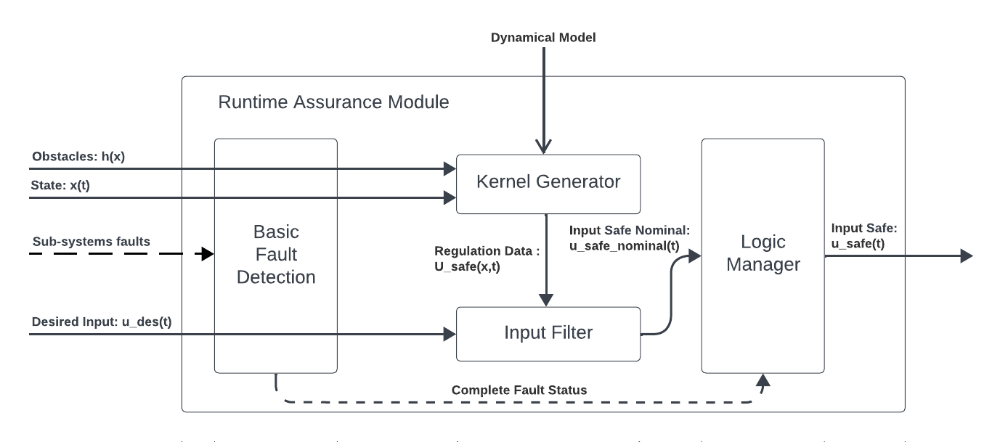

Run-time Assurance
####################

.. _contact 3Laws: mailto:sales@3laws.io

.. contents:: Table of Contents
  :local:

The Run-time Assurance Module (RAM) is the heart of the Supervisor. This module is responsible for determining the appropriate command to send to the robot to stay safe in light of the available information it has about the system. It is broken up into 3 main components:

- **The Kernel Generator**: This component is responsible for determining, based the a Dynamical Model of a system, it's current state, and the current and predicted state of the environment, the set of possible actions that can be taken to keep the system safe. This set of actions is then passed to the input filter.

- **The Input Filter**: This component is responsible for selecting out of the set of safe commands one that is a close as possible to the desired command sent by the autonomy stack.

- **Fault Manager**: This component is responsible for detecting basic fault in the signals sent by the autonomy stack to the RAM, and for implementing a appropriate stopping strategies.

Dynamical Model
===============

In order for the kernel generator to determine the set of safe commands that can be sent to the robot, it must be able to quantify  how the robot will behave when it receives a particular command. This is done through the use of a dynamical model.

A dynamical model of a robot is defined by 6 items:

- A **state** vector :math:`x \in \mathbb{R}^\text{nx}` representing the set of relevant physical quantities for that robot (like position, orientation, velocity, etc...).

- An **input** vector :math:`u \in \mathbb{R}^\text{nu}`  representing the set of relevant cyber-physical quantities for that robot that can be controlled directly (like motor torque, desired velocity, etc...).

- A set of **equations of motion**, of the vectorized form :math:`\dot{x} = f(x,u)` that describe how the state of the robot evolves over time when it receives a particular input. These equations of motions will often be parameterized by known fixed quantities :math:`p \in \mathbb{R}^\text{np}` called **model parameters** (like mass, distance between wheels, etc...),i.e. :math:`\dot{x} = f(x,u,p)`

- An **input constraints** set :math:`U \subseteq \mathbb{R}^\text{nu}` that represents the set of all possible inputs that can be sent to the robot.

- A **state domain** set :math:`X \subseteq \mathbb{R}^\text{nx}` that represents the domain for which the equations of motion are valid, in particular w.r.t the process covariance matrix.

- A **process noise covariance matrix**, being the probability distribution of the actual :math:`\dot{x}` around the predicted value by :math:`f(x,u)` for all given :math:`x \in X` and :math:`u \in U`.

The Supervisor currently ships with 3 supported dynamical models:

Unicycle
--------
This model is a 3-states, 2-inputs model that describes the movement of a robot evolving on SE2 (2D planar space with orientation), where one can control it's longitudinal and angular speed directly. This model is particularly well suited for differential drive robots with fast acceleration and deceleration.

  - Model state: :math:`\left[x,y,\theta \right]`

  - Model input: :math:`\left[ v_x, \omega \right]`

  - Model parameters: None

  - Equations of motion: :math:`\begin{cases} \dot{x} = v_x \cos(\theta) \\ \dot{y} = v_x \sin(\theta) \\ \dot{\theta} = \omega \end{cases}`

  - State domain: :math:`\mathbb{R}^3`

  - Input constraints: User defined `hyperbox <https://en.wikipedia.org/wiki/Hyperrectangle>`_ in :math:`\mathbb{R}^2`

  - Process noise covariance matrix: Identity matrix

Omnidirectional
---------------
This model is a 3-states, 3-inputs model that describes the movement of a robot evolving on SE2 (2D planar space with orientation), where one can control it's longitudinal, transverse and angular speed directly. This model is particularly well suited for mobile robots with omni wheels, quadruped, or surface vessels with fast acceleration and deceleration.

  - Model state: :math:`\left[x,y,\theta \right]`

  - Model input: :math:`\left[ v_x, v_y, \omega \right]`

  - Model parameters: None

  - Equations of motion: :math:`\begin{cases} \dot{x} = v_x \cos(\theta) - v_y \sin(\theta) \\ \dot{y} = v_x \sin(\theta) + v_y \cos(\theta) \\ \dot{\theta} = \omega \end{cases}`

  - State domain: :math:`\mathbb{R}^3`

  - Input constraints: User defined `hyperbox <https://en.wikipedia.org/wiki/Hyperrectangle>`_ in :math:`\mathbb{R}^3`

  - Process noise covariance matrix: Identity matrix

Bicycle (experimental)
--------------------------
This model is a 3-states, 2-inputs model that describes the movement of a robot evolving on SE2 (2D planar space with orientation), where one can control it's longitudinal speed and front wheel steering angle directly. This model is particularly well suited for mobile robots with omni wheels, quadruped, or surface vessels with fast acceleration and deceleration.

  - Model state: :math:`\left[x,y,\theta \right]`

  - Model input: :math:`\left[ v_x, \delta \right]`

  - Model parameters:

    - :math:`wheel_{dx}`: Distance between front and back wheels (m)

    - :math:`origin_{dx}`: Position of vehicle origin w.r.t back wheels (m)

  - Equations of motion: :math:`\begin{cases} \dot{x} = v_x \cos(\theta) \\ \dot{y} = v_x \sin(\theta) \\ \dot{\theta} = v_x * \tan(\delta) * \frac{\cos(\beta)}{wheel_{dx}} \end{cases}` where :math:`\beta = \arctan(\frac{origin_{dx}}{wheel_{dx}}\tan(\delta))`

  - State domain: :math:`\mathbb{R}^3`

  - Input constraints: User defined `hyperbox <https://en.wikipedia.org/wiki/Hyperrectangle>`_ in :math:`\mathbb{R}^2`. Note that the steering angle must be between :math:`-\frac{\pi}{2}` and :math:`\frac{\pi}{2}`.

  - Process noise covariance matrix: Identity matrix

.. note::
  The Supervisor is able to support many more dynamical models. If you have a dynamical model that you would like to use with the Supervisor, please `contact 3laws`_.

Safety Maps
===========

The other critical part of configuring the RAM is defining what the robot should avoid. The Supervisor able to enforce any arbitrary non-linear constraint on the robot's state. These set of constraints are organized into what we call **Safety Maps**. A safety map is a function that takes the current state of the robot and returns a vector of values of the constraints to be enforced at that current state, along with information on the gradient of the constraints w.r.t the state.

The Supervisor currently ships with two safety maps, one for geometric collision constraints, as determined by data from a laserscan sensor, and/or a map of obstacles.

Laserscan
-----------
The laserscan Safety Map defines constraints corresponding to the distance between the robot geometry, and a carefully chosen set of capsules centered around consecutive points of the laserscan. The Supervisor will enforce that the robot does not collide with any of these capsules. The size of these capsules can be controlled by the **collision distance threshold** parameter (see :ref:`control panel configuration <config_sup_collision_distance>`).

Obstacles
-------------

The Obstacles Safety Map defines constraints corresponding to the distance between the robot geometry and the a set of obstacles geometries.

.. note::
  The Supervisor is able to support many more sensors and constraint representations. Please `contact 3laws`_ to learn more about all the type of constraints we can enforce.

.. Behavior Tuning
.. ===============

.. .. note::
..   For more information on mathematics and algorithms behind the RAM, please refer to the :doc:`knowledge section <../knowledge>`.

.. Fault Management
.. ================

.. Handling uncertainties and delays
.. =================================

.. 3 types of uncertainties, sensing, dynamical model, timing.
.. Effect of each

.. Current, uncertainties and delays are not accounted for explicitly.

.. You can mitigate their effect by tuning beta, alpha, and inflating obstacle size

.. .. note::
..   The Supervisor is able to account for uncertainty in an explicit and quantitative way. Please `contact 3laws`_ to learn more about the process tailoring Supervisor to account for uncertainties and delays in your system.
