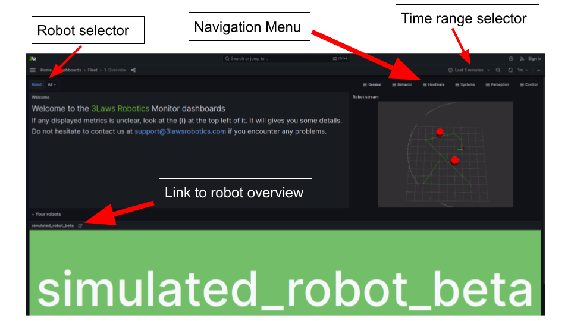

Visualization
#############

Visualization is a key part of the monitoring system.

.. contents:: Table of Contents
   :depth: 2
   :local:

Dashboards
**********

In order to visualize your monitoring data, you can request for 3Laws to provide a `Grafana <https://grafana.com/grafana/>`_ dashboard. You can access it by opening your web browser and navigating to `https://3laws.app <https://3laws.app>`_.  Your login credentials will be given to you by your 3LawsRobotics representative.

This dashboard is tailored to provide quick diagnostics. The workflow is intended to help you dive into the data that is relevant to your current operations. The dashboards are organized as follows:

- **General**: This page displays a list of robots (based on your organization login) that are currently monitored along with their current state. It also provides a list of the most recent events that have been recorded by the monitoring system.
- **Behavior**: Various insights related to the behavior of your robot, like his computed safety score, your distance to obstacles, etc. are provided here.
- **Hardware**: The hardware health of the robot, based on agreement between the model-based predicted behavior of the system and the measured behavior is presented. The objective is to expose if the current physical behavior is as expected or if some degradation has occurred.
- **Systems**: This gives information about the computational infrastructure such as signals delay, computer usage and Node status.
- **Perception**: Sensors issues like obstructed LIDARs or high noise can be surmized from this.
- **Control**: This is where the system's tracking of the commands is displayed. Large errors indicate either poor system behavior or infeasible commands.

Each dashboard is composed of several panels including an overview section and specific-measurand displays.

Navigation Tools
================

The dashboards provide several navigation methods so that issues can be found either by topic or by timestamp. The navigation tools are highlighted in the following image:

        
- **Time Range**: This tool allows selection the time range of the data that you want to visualize. Range can be predefined range or customized.

- **Refresh**: Pressing this requests a refresh of the data displayed in the dashboard. Alternatively a fixed refresh rate can be selected.

Incident Management
===================

The Dashboards display a chronological list of events including the severity and whether the event is still active.  Double clicking on the event provides navigate directly to the associated dashboard page.

.. image:: data/robot_overview_annotated.png
  :width: 800
  :alt: Robot Overview Dashboard
